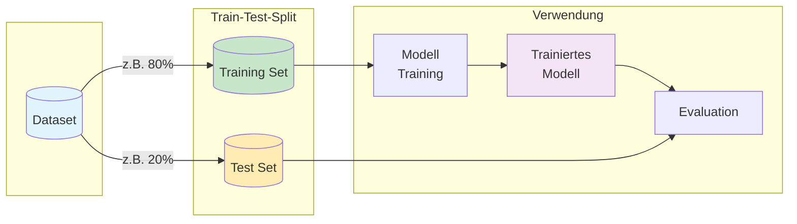
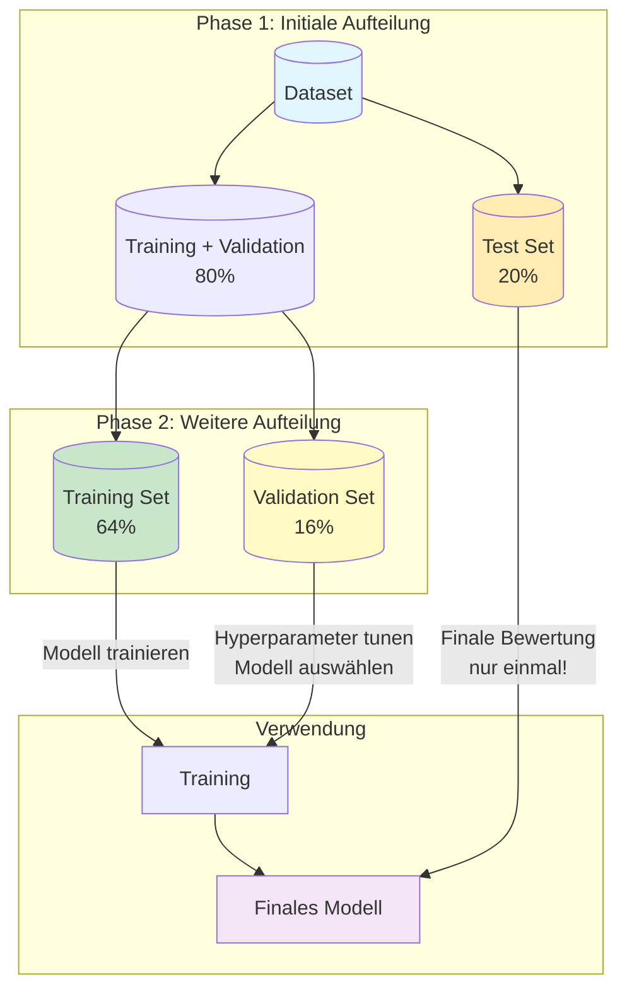
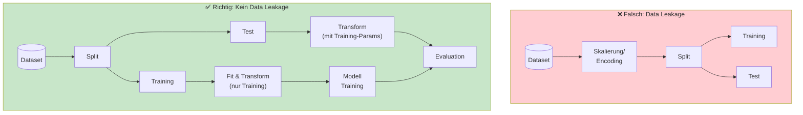
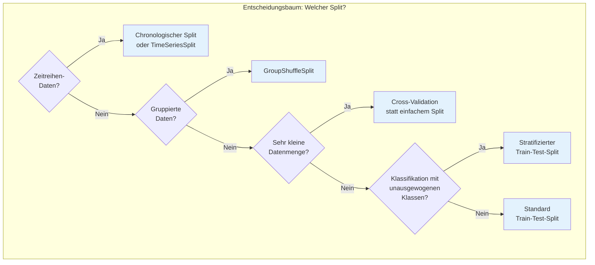

# Train-Test-Split
{: .no_toc }

> **Aufteilung von Daten für Training und Evaluation**
> 80-20-Split, Stratified Split, Random State und Best Practices

---

## Überblick

Der Train-Test-Split ist ein fundamentales Verfahren im Machine Learning, um die Leistungsfähigkeit von Modellen zu überprüfen. Das Prinzip ist einfach: Die verfügbaren Daten werden in zwei separate Mengen aufgeteilt – eine zum Trainieren des Modells und eine zum Testen seiner Vorhersagefähigkeit.



## Warum ist der Split notwendig?

Das zentrale Ziel eines Machine-Learning-Modells ist die **Generalisierungsfähigkeit** – die Fähigkeit, auf neuen, unbekannten Daten gute Vorhersagen zu treffen. Ein Modell, das nur auf bereits gesehenen Daten gut funktioniert, hat keinen praktischen Nutzen.

**Das Problem ohne Split:**
- Ein Modell könnte die Trainingsdaten auswendig lernen (Overfitting)
- Die gemessene Leistung wäre unrealistisch hoch
- Im Produktiveinsatz würde das Modell versagen

**Die Lösung mit Split:**
- Das Modell wird nur mit Trainingsdaten trainiert
- Die Testdaten simulieren "neue, unbekannte" Daten
- Die Evaluation auf Testdaten zeigt die realistische Leistung

## Gängige Aufteilungsverhältnisse

| Verhältnis | Training | Test | Typischer Einsatz |
|------------|----------|------|-------------------|
| **80-20** | 80% | 20% | Standardwahl für die meisten Datensätze |
| **70-30** | 70% | 30% | Bei kleineren Datensätzen oder höherem Validierungsbedarf |
| **60-40** | 60% | 40% | Bei sehr kleinen Datensätzen |
| **90-10** | 90% | 10% | Bei sehr großen Datensätzen (>100.000 Samples) |

**Faustregel:** Je größer der Datensatz, desto kleiner kann der Testanteil sein, da auch ein kleinerer Prozentsatz noch statistisch aussagekräftig ist.

## Implementierung mit scikit-learn

### Grundlegende Verwendung

```python
from sklearn.model_selection import train_test_split

# Beispieldaten
X = df.drop('target', axis=1)  # Features
y = df['target']                # Zielvariable

# Split durchführen
X_train, X_test, y_train, y_test = train_test_split(
    X, y,
    test_size=0.2,      # 20% für Test
    random_state=42     # Reproduzierbarkeit
)

print(f"Training: {len(X_train)} Samples")
print(f"Test:     {len(X_test)} Samples")
```

### Wichtige Parameter

```python
X_train, X_test, y_train, y_test = train_test_split(
    X, y,
    test_size=0.2,       # Anteil oder absolute Anzahl für Test
    train_size=None,     # Optional: Anteil für Training
    random_state=42,     # Seed für Reproduzierbarkeit
    shuffle=True,        # Daten vor Split mischen
    stratify=y           # Klassenverteilung beibehalten
)
```

### Stratifizierter Split bei Klassifikation

Bei unausgewogenen Klassen sollte der Split die Klassenverteilung in beiden Mengen beibehalten:

```python
# Ohne Stratifizierung (problematisch bei unausgewogenen Klassen)
X_train, X_test, y_train, y_test = train_test_split(X, y, test_size=0.2)

# Mit Stratifizierung (empfohlen für Klassifikation)
X_train, X_test, y_train, y_test = train_test_split(
    X, y,
    test_size=0.2,
    stratify=y,          # Klassenverteilung beibehalten
    random_state=42
)

# Überprüfung der Verteilung
print("Original:", y.value_counts(normalize=True))
print("Training:", y_train.value_counts(normalize=True))
print("Test:    ", y_test.value_counts(normalize=True))
```

## Train-Validate-Test-Split

Für eine robustere Modellentwicklung wird oft ein dreifacher Split verwendet:



### Zweck der drei Mengen

| Menge | Zweck | Verwendung |
|-------|-------|------------|
| **Training Set** | Modell trainieren | Lernen der Muster und Parameter |
| **Validation Set** | Modell optimieren | Hyperparameter-Tuning, Modellauswahl |
| **Test Set** | Finale Bewertung | Einmalige, unvoreingenommene Evaluation |

### Implementierung

```python
from sklearn.model_selection import train_test_split

# Erster Split: Trainings-/Validierungs-Set vs. Test-Set
X_temp, X_test, y_temp, y_test = train_test_split(
    X, y,
    test_size=0.2,
    random_state=42,
    stratify=y
)

# Zweiter Split: Training-Set vs. Validation-Set
X_train, X_val, y_train, y_val = train_test_split(
    X_temp, y_temp,
    test_size=0.2,       # 20% von 80% = 16% des Originals
    random_state=42,
    stratify=y_temp
)

print(f"Training:   {len(X_train)} Samples ({len(X_train)/len(X)*100:.1f}%)")
print(f"Validation: {len(X_val)} Samples ({len(X_val)/len(X)*100:.1f}%)")
print(f"Test:       {len(X_test)} Samples ({len(X_test)/len(X)*100:.1f}%)")
```

## Data Leakage vermeiden

**Data Leakage** bezeichnet die unbeabsichtigte Verwendung von Informationen aus dem Test-Set während des Trainings. Dies führt zu unrealistisch guten Ergebnissen, die sich nicht in der Praxis bestätigen.



### Häufige Quellen von Data Leakage

1. **Skalierung vor dem Split**
   ```python
   # ❌ FALSCH: Skalierung auf gesamtem Dataset
   scaler = StandardScaler()
   X_scaled = scaler.fit_transform(X)  # Lernt von allen Daten!
   X_train, X_test, y_train, y_test = train_test_split(X_scaled, y)
   
   # ✅ RICHTIG: Skalierung nur auf Training-Daten
   X_train, X_test, y_train, y_test = train_test_split(X, y)
   scaler = StandardScaler()
   X_train_scaled = scaler.fit_transform(X_train)  # Nur Training
   X_test_scaled = scaler.transform(X_test)        # Nur Transform!
   ```

2. **Imputation vor dem Split**
   ```python
   # ❌ FALSCH: Mittelwert aus allen Daten
   X['feature'].fillna(X['feature'].mean(), inplace=True)
   
   # ✅ RICHTIG: Mittelwert nur aus Training-Daten
   train_mean = X_train['feature'].mean()
   X_train['feature'].fillna(train_mean, inplace=True)
   X_test['feature'].fillna(train_mean, inplace=True)
   ```

3. **Feature Engineering vor dem Split**
   ```python
   # ❌ FALSCH: Encoding auf gesamtem Dataset
   encoder = LabelEncoder()
   df['category_encoded'] = encoder.fit_transform(df['category'])
   
   # ✅ RICHTIG: Mit Pipeline nach dem Split
   ```

### Lösung: Pipelines verwenden

Pipelines in scikit-learn verhindern Data Leakage automatisch:

```python
from sklearn.pipeline import Pipeline
from sklearn.preprocessing import StandardScaler
from sklearn.impute import SimpleImputer
from sklearn.linear_model import LogisticRegression

# Pipeline definieren
pipeline = Pipeline([
    ('imputer', SimpleImputer(strategy='mean')),
    ('scaler', StandardScaler()),
    ('classifier', LogisticRegression())
])

# Split durchführen
X_train, X_test, y_train, y_test = train_test_split(X, y, test_size=0.2)

# Pipeline auf Training-Daten fitten
pipeline.fit(X_train, y_train)  # Alle Schritte lernen nur von X_train

# Vorhersage auf Test-Daten
y_pred = pipeline.predict(X_test)  # Transformation mit Training-Parametern
```

## Workflow: Vollständiges Beispiel

```python
import pandas as pd
from sklearn.model_selection import train_test_split
from sklearn.pipeline import Pipeline
from sklearn.compose import ColumnTransformer
from sklearn.preprocessing import StandardScaler, OneHotEncoder
from sklearn.impute import SimpleImputer
from sklearn.ensemble import RandomForestClassifier
from sklearn.metrics import classification_report

# 1. Daten laden
df = pd.read_csv('daten.csv')
X = df.drop('target', axis=1)
y = df['target']

# 2. Feature-Typen identifizieren
numeric_features = X.select_dtypes(include=['int64', 'float64']).columns
categorical_features = X.select_dtypes(include=['object', 'category']).columns

# 3. Preprocessing-Pipeline definieren
numeric_transformer = Pipeline([
    ('imputer', SimpleImputer(strategy='median')),
    ('scaler', StandardScaler())
])

categorical_transformer = Pipeline([
    ('imputer', SimpleImputer(strategy='most_frequent')),
    ('encoder', OneHotEncoder(handle_unknown='ignore'))
])

preprocessor = ColumnTransformer([
    ('num', numeric_transformer, numeric_features),
    ('cat', categorical_transformer, categorical_features)
])

# 4. Vollständige Pipeline mit Modell
model_pipeline = Pipeline([
    ('preprocessor', preprocessor),
    ('classifier', RandomForestClassifier(random_state=42))
])

# 5. Train-Test-Split
X_train, X_test, y_train, y_test = train_test_split(
    X, y,
    test_size=0.2,
    random_state=42,
    stratify=y
)

# 6. Training
model_pipeline.fit(X_train, y_train)

# 7. Evaluation
y_pred = model_pipeline.predict(X_test)
print(classification_report(y_test, y_pred))
```

## Best Practices

### Dos ✅

- **Immer `random_state` setzen** für Reproduzierbarkeit
- **Stratifizierung verwenden** bei Klassifikation mit unausgewogenen Klassen
- **Pipelines nutzen** um Data Leakage zu vermeiden
- **Test-Set nur einmal verwenden** für die finale Bewertung
- **Shuffle aktiviert lassen** (Standard), außer bei Zeitreihen

### Don'ts ❌

- **Niemals auf Test-Daten trainieren** oder Hyperparameter tunen
- **Keine Vorverarbeitung vor dem Split** (Skalierung, Encoding, Imputation)
- **Test-Set nicht mehrfach verwenden** für Modellauswahl
- **Shuffle nicht bei Zeitreihen** – zeitliche Reihenfolge beachten

## Sonderfälle

### Zeitreihen-Daten

Bei Zeitreihen darf nicht zufällig gesplittet werden:

```python
# ❌ FALSCH für Zeitreihen
X_train, X_test = train_test_split(X, shuffle=True)

# ✅ RICHTIG für Zeitreihen: Chronologischer Split
split_index = int(len(X) * 0.8)
X_train, X_test = X[:split_index], X[split_index:]
y_train, y_test = y[:split_index], y[split_index:]

# Oder mit TimeSeriesSplit für Cross-Validation
from sklearn.model_selection import TimeSeriesSplit
tscv = TimeSeriesSplit(n_splits=5)
```

### Sehr kleine Datensätze

Bei kleinen Datensätzen (<1000 Samples) ist Cross-Validation oft besser:

```python
from sklearn.model_selection import cross_val_score

# Statt einem einzelnen Split
scores = cross_val_score(model, X, y, cv=5, scoring='accuracy')
print(f"Accuracy: {scores.mean():.3f} (+/- {scores.std()*2:.3f})")
```

### Gruppierte Daten

Wenn Samples zu Gruppen gehören (z.B. mehrere Messungen pro Patient):

```python
from sklearn.model_selection import GroupShuffleSplit

# Sicherstellen, dass alle Samples einer Gruppe im selben Set landen
gss = GroupShuffleSplit(n_splits=1, test_size=0.2, random_state=42)
train_idx, test_idx = next(gss.split(X, y, groups=patient_ids))

X_train, X_test = X.iloc[train_idx], X.iloc[test_idx]
y_train, y_test = y.iloc[train_idx], y.iloc[test_idx]
```

## Zusammenfassung



Der Train-Test-Split ist die Grundlage für zuverlässige Modellbewertung. Die korrekte Anwendung – insbesondere die Vermeidung von Data Leakage – ist entscheidend für aussagekräftige Ergebnisse und erfolgreiche ML-Projekte.

## Weiterführende Themen

- **Cross-Validation**: Robustere Bewertung durch mehrfache Splits
- **Nested Cross-Validation**: Kombination von Modellauswahl und Evaluation
- **Bootstrapping**: Resampling-Technik für Konfidenzintervalle

---

*Referenzen:*
- scikit-learn Dokumentation: [train_test_split](https://scikit-learn.org/stable/modules/generated/sklearn.model_selection.train_test_split.html)
- KNIME: Data Preprocessing for Machine Learning Part 1 & Part 2

---

**Version:** 1.0
**Stand:** Januar 2026
**Kurs:** Machine Learning. Verstehen. Anwenden. Gestalten.
