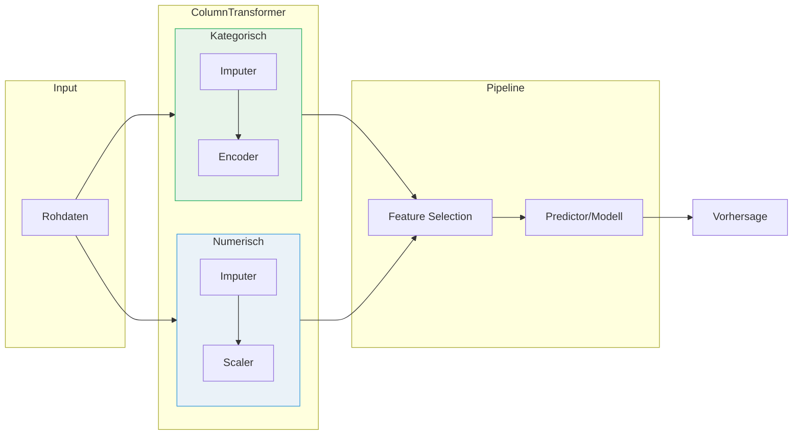
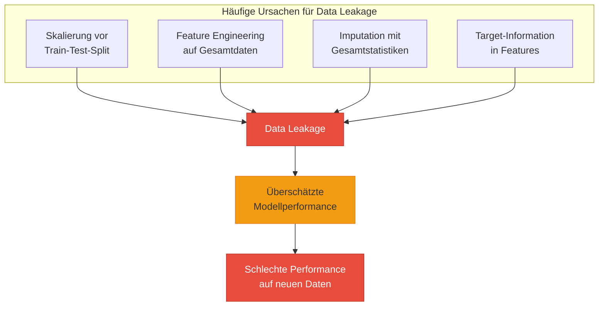

# Pipelines & Best Practices
{: .no_toc }

> **Pipelines, ColumnTransformer und Best Practices für reproduzierbare ML-Workflows in scikit-learn**

---

# Inhaltsverzeichnis
{: .no_toc .text-delta }

1. TOC
{:toc}

---

## Anwendung von Modellen in scikit-learn

Scikit-learn ermöglicht unterschiedliche Ansätze zur Definition und Verwendung von Skalierungs- und Codierungsmodellen. Die zentrale Frage ist, ob man eine Instanz eines Skalierers oder Codierers explizit erstellt und speichert – oder die Transformation direkt auf den Daten anwendet.

### Vergleich der Ansätze

| Ansatz | Beispiel | Vorteile | Nachteile |
|--------|----------|----------|-----------|
| **Direkte Anwendung** | `MinMaxScaler().fit_transform(data)` | Kürzerer, direkter Code; geeignet für einmalige Anwendungen | Keine Wiederverwendung des Modells; erschwert Reproduzierbarkeit; keine inverse Transformation möglich |
| **Explizite Definition** | `scaler = MinMaxScaler()`<br>`scaler.fit_transform(data)` | Ermöglicht Wiederverwendung und Konsistenz; gute Reproduzierbarkeit; ermöglicht inverse Transformation | Mehr Codezeilen; leicht erhöhte Komplexität |

### Empfehlung

Für produktionsreife ML-Workflows sollte **immer die explizite Definition** verwendet werden. Dies ermöglicht:

- Konsistente Transformation von Trainings- und Testdaten
- Speicherung des Transformers für spätere Verwendung
- Inverse Transformation bei Bedarf
- Bessere Nachvollziehbarkeit und Debugging

```python
from sklearn.preprocessing import MinMaxScaler

# Explizite Definition (empfohlen)
scaler = MinMaxScaler()
X_train_scaled = scaler.fit_transform(X_train)
X_test_scaled = scaler.transform(X_test)  # Nur transform, nicht fit!

# Inverse Transformation möglich
X_original = scaler.inverse_transform(X_train_scaled)
```

---

## Daten direkt transformieren?

Bei der Entscheidung, ob Originaldaten überschrieben oder in separate Variablen transformiert werden sollen, spielen mehrere Faktoren eine Rolle:

### Datenerhaltung

Wenn die originalen Daten für spätere Analysen oder Vergleiche benötigt werden, ist es besser, eine separate Variable (z.B. `scaled_data`) zu erstellen. So bleiben die originalen Daten unverändert.

```python
# Originaldaten erhalten
X_scaled = scaler.fit_transform(X)

# vs. Originaldaten überschreiben (nicht empfohlen)
X = scaler.fit_transform(X)  # Original verloren!
```

### Speicherplatz

Bei sehr großen Datensätzen könnte die direkte Anwendung auf die Daten effizienter sein, da weniger Speicher verbraucht wird. In diesem Fall sollte man sich bewusst sein, dass die Originaldaten verloren gehen.

### Klarheit und Wartbarkeit

Die Verwendung separater Variablen macht den Code klarer und leichter wartbar, da deutlich wird, welche Daten bearbeitet wurden und welche nicht.

```python
# Klar und wartbar
X_train_imputed = imputer.fit_transform(X_train)
X_train_scaled = scaler.fit_transform(X_train_imputed)
X_train_encoded = encoder.fit_transform(X_train_scaled)
```

### Wiederverwendung und Reproduzierbarkeit

Wenn dieselbe Transformation auf mehrere Datensätze (z.B. Trainings- und Testdaten) angewandt werden soll, ist die separate Implementierung der Skalierung als eigenständiger Schritt unerlässlich.

> **Best Practice**
>
> Verwende immer separate Variablen für transformierte Daten und speichere die Transformer-Objekte. Dies gewährleistet Reproduzierbarkeit und ermöglicht die konsistente Anwendung auf neue Daten.

---

## Pipelines

Eine Pipeline ist eine Reihe von Aufgaben, die nacheinander ausgeführt werden. Die Ausgabe einer Aufgabe ist die Eingabe der nächsten Aufgabe, bis am Ende das Endprodukt (z.B. eine Vorhersage) ausgegeben wird.

### Vorteile von Pipelines

- **Beschleunigung der Datenaufbereitung** durch automatisierte Verkettung von Schritten
- **Konsistenz** bei der Anwendung auf Test- und neue Daten
- **Vermeidung von Data Leakage** durch korrekte Trennung von fit und transform
- **Einfache Reproduzierbarkeit** des gesamten Workflows
- **Vereinfachte Hyperparameter-Optimierung** mit GridSearchCV/RandomizedSearchCV

### Pipeline-Architektur



### Beispiel: Einfache Pipeline

```python
from sklearn.pipeline import Pipeline
from sklearn.preprocessing import StandardScaler
from sklearn.impute import SimpleImputer
from sklearn.linear_model import LogisticRegression

# Pipeline definieren
pipeline = Pipeline([
    ('imputer', SimpleImputer(strategy='median')),
    ('scaler', StandardScaler()),
    ('classifier', LogisticRegression())
])

# Training - fit wird auf alle Schritte angewendet
pipeline.fit(X_train, y_train)

# Vorhersage - transform wird automatisch verkettet
y_pred = pipeline.predict(X_test)
```

---

## Pipeline und ColumnTransformer

In der Praxis werden oft beide Komponenten kombiniert, wobei der ColumnTransformer innerhalb einer Pipeline genutzt wird, um komplexe Datenverarbeitungs-Workflows zu erstellen.

### Funktionsvergleich

| Komponente | Funktionsweise | Einsatzbereich |
|------------|----------------|----------------|
| **Pipeline** | Verkettung von Transformatoren in **sequentieller** Reihenfolge, gefolgt von einem finalen Schätzer | Erstellen einer ML-Pipeline, die Daten erst transformiert und dann prognostiziert |
| **ColumnTransformer** | Anwendung verschiedener Transformatoren auf verschiedene Spalten **parallel**, anschließend Verkettung der Ausgaben | Unterschiedliche Transformationen für verschiedene Datentypen (numerisch vs. kategorisch) |

### Kombinierte Anwendung

```python
from sklearn.compose import ColumnTransformer
from sklearn.pipeline import Pipeline
from sklearn.preprocessing import StandardScaler, OneHotEncoder
from sklearn.impute import SimpleImputer
from sklearn.ensemble import RandomForestClassifier

# Spalten definieren
numeric_features = ['age', 'income', 'hours_per_week']
categorical_features = ['education', 'occupation', 'marital_status']

# Transformationen für numerische Spalten
numeric_transformer = Pipeline([
    ('imputer', SimpleImputer(strategy='median')),
    ('scaler', StandardScaler())
])

# Transformationen für kategorische Spalten
categorical_transformer = Pipeline([
    ('imputer', SimpleImputer(strategy='most_frequent')),
    ('encoder', OneHotEncoder(handle_unknown='ignore'))
])

# ColumnTransformer kombiniert beide
preprocessor = ColumnTransformer([
    ('num', numeric_transformer, numeric_features),
    ('cat', categorical_transformer, categorical_features)
])

# Vollständige Pipeline mit Preprocessor und Modell
full_pipeline = Pipeline([
    ('preprocessor', preprocessor),
    ('classifier', RandomForestClassifier(n_estimators=100))
])

# Training und Vorhersage
full_pipeline.fit(X_train, y_train)
y_pred = full_pipeline.predict(X_test)
```

---

## Eigenschaften von Pipelines

### Zugriff auf Zwischenergebnisse

In einer scikit-learn Pipeline hat man **keinen direkten Zugriff** auf die Zwischenergebnisse der Transformationen. Die Pipeline ist so konzipiert, dass sie einen sequenziellen Prozess kapselt, wobei der Fokus auf der Endvorhersage liegt.

Um auf transformierte Daten zuzugreifen, muss man die Transformationen **manuell außerhalb** der Pipeline durchführen oder nachbauen.

### Zugriff auf Pipeline-Schritte

Man kann jedoch auf Teilschritte und deren Eigenschaften zugreifen. Jeder Schritt wird als Tupel aus einem Namen und einem Transformer oder Modell definiert:

```python
# Zugriff auf einen bestimmten Schritt
scaler = pipeline.named_steps['scaler']

# Eigenschaften des Schritts abrufen
print(scaler.mean_)   # Mittelwerte (nach fit)
print(scaler.scale_)  # Skalierungsfaktoren

# Bei ColumnTransformer: Zugriff auf Unter-Transformer
preprocessor = full_pipeline.named_steps['preprocessor']
num_pipeline = preprocessor.named_transformers_['num']
```

### Wichtige Methoden

```python
# Nur transformieren (ohne Modell)
X_transformed = full_pipeline[:-1].transform(X_test)

# Feature-Namen nach Transformation abrufen (sklearn >= 1.0)
feature_names = full_pipeline[:-1].get_feature_names_out()

# Modellparameter abrufen
model = full_pipeline.named_steps['classifier']
print(model.feature_importances_)
```

---

## Pipelines in Keras

In Keras lassen sich **keine Pipelines** im Sinne von scikit-learn definieren. Es können jedoch verschiedene Vorverarbeitungsschritte direkt in das Modell integriert werden:

### Integrierbare Vorverarbeitungsschichten

| Schicht | Funktion |
|---------|----------|
| **Normalization** | Anpassung der Skalierung der Eingabedaten |
| **CategoryEncoding** | Umwandlung von kategorialen Daten in numerische Formate |
| **TextVectorization** | Umwandlung von Textdaten in eine geeignete Form |
| **Rescaling** | Reskalieren von Bilddaten |
| **RandomFlip, RandomRotation** | Daten-Augmentierung für Bilder |

### Beispiel: Preprocessing-Layer in Keras

```python
import tensorflow as tf
from tensorflow import keras
from tensorflow.keras import layers

# Normalization-Layer
normalizer = layers.Normalization()
normalizer.adapt(X_train)  # Statistiken lernen

# Modell mit integrierter Vorverarbeitung
model = keras.Sequential([
    normalizer,  # Preprocessing als Teil des Modells
    layers.Dense(64, activation='relu'),
    layers.Dense(32, activation='relu'),
    layers.Dense(1, activation='sigmoid')
])

model.compile(optimizer='adam', loss='binary_crossentropy')
model.fit(X_train, y_train, epochs=10)
```

### Vorteile der Integration

- Vereinfachter Workflow durch Kombination von Preprocessing und Modell
- Verbesserte Portabilität – das gespeicherte Modell enthält die Vorverarbeitung
- Konsistente Transformation bei Inferenz

---

## Data Leakage

Data Leakage tritt auf, wenn Informationen von außerhalb des Trainingsdatensatzes verwendet werden, um das Modell zu erstellen. Diese zusätzlichen Informationen können zu **übermäßig optimistischen** oder sogar **völlig ungültigen** Vorhersagemodellen führen.

### Häufige Ursachen



### Vermeidung von Data Leakage

**1. Erst splitten, dann transformieren**

```python
# FALSCH - Data Leakage!
X_scaled = scaler.fit_transform(X)  # Gesamtdaten
X_train, X_test = train_test_split(X_scaled)

# RICHTIG
X_train, X_test = train_test_split(X)
scaler.fit(X_train)
X_train_scaled = scaler.transform(X_train)
X_test_scaled = scaler.transform(X_test)
```

**2. Pipelines verwenden**

Pipelines stellen automatisch sicher, dass `fit` nur auf Trainingsdaten angewendet wird:

```python
pipeline.fit(X_train, y_train)  # fit nur auf Training
pipeline.predict(X_test)         # nur transform auf Test
```

**3. Cross-Validation korrekt anwenden**

```python
from sklearn.model_selection import cross_val_score

# Pipeline innerhalb der Cross-Validation
scores = cross_val_score(pipeline, X, y, cv=5)
# Jeder Fold: fit auf Training, transform auf Validation
```

> **Wichtig**
>
> Neben der Trennung von Trainings- und Testdaten sollte auch die **Codierung und Skalierung getrennt** erfolgen. Statistiken (Mittelwert, Standardabweichung, Kategorien) dürfen nur aus den Trainingsdaten berechnet werden!

---

## Zusammenfassung

| Konzept | Kernaussage |
|---------|-------------|
| **Explizite Definition** | Transformer immer als Objekt speichern für Wiederverwendung und Reproduzierbarkeit |
| **Pipelines** | Automatisieren den Workflow und verhindern Data Leakage |
| **ColumnTransformer** | Ermöglicht unterschiedliche Transformationen für verschiedene Spaltentypen |
| **Keras-Integration** | Vorverarbeitung kann direkt ins Modell integriert werden |
| **Data Leakage** | Vermeiden durch korrektes Splitten und Verwendung von Pipelines |

---

## Weiterführende Ressourcen

- [scikit-learn Pipeline Documentation](https://scikit-learn.org/stable/modules/compose.html)
- [ColumnTransformer Guide](https://scikit-learn.org/stable/modules/generated/sklearn.compose.ColumnTransformer.html)
- [Keras Preprocessing Layers](https://keras.io/guides/preprocessing_layers/)
- [Data Leakage Explained](https://machinelearningmastery.com/data-leakage-machine-learning/)

---
**Version:** 1.0    
**Stand:** Januar 2026    
**Kurs:** Machine Learning. Verstehen. Anwenden. Gestalten.    