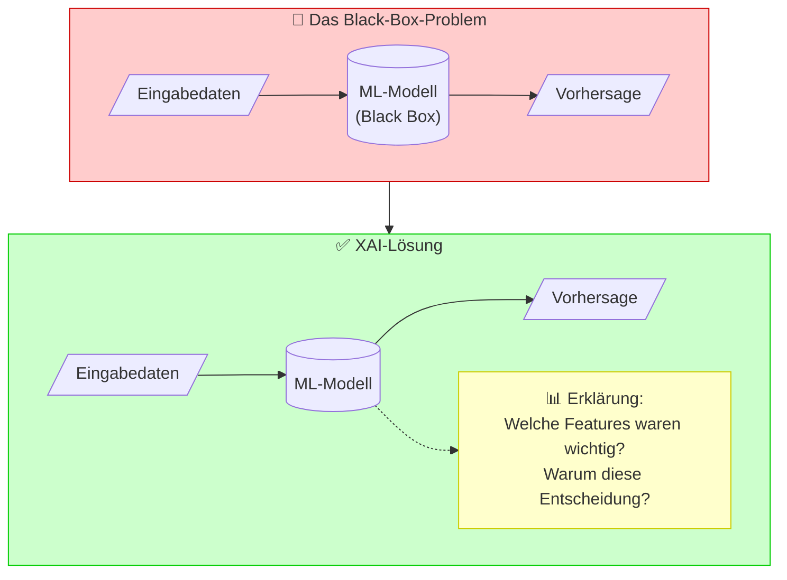
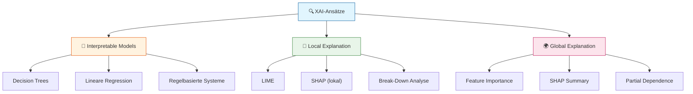
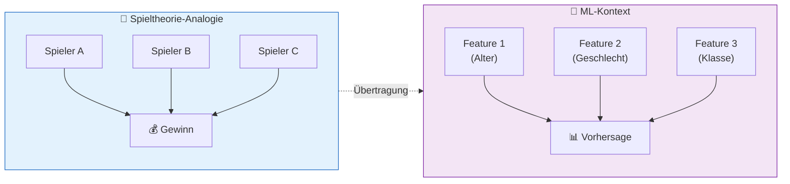
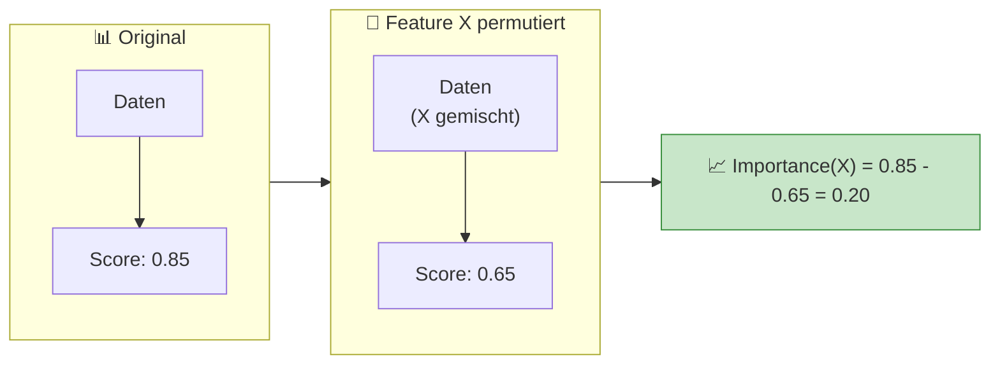
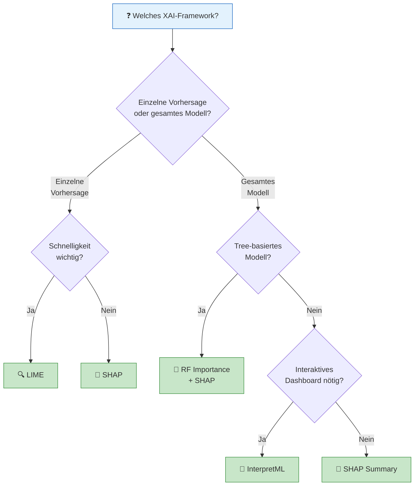

# Methoden & Frameworks
{: .no_toc }

> **Explainable AI (XAI) umfasst Methoden und Techniken, die ML-Modelle für Menschen verständlich und nachvollziehbar machen.** 

---

## Inhaltsverzeichnis
{: .no_toc .text-delta }

1. TOC
{:toc}

---

## Einführung in XAI

### Was ist Explainable AI?

Explainable AI (XAI) ist ein Ansatz der künstlichen Intelligenz, der darauf abzielt, dass die Funktionsweise und Entscheidungen von ML-Modellen für Menschen verständlich und nachvollziehbar sind.



### Warum ist XAI wichtig?

Die Umsetzung von XAI-Methoden trägt dazu bei, das Vertrauen in KI-Systeme zu erhöhen, indem sie Transparenz und Nachvollziehbarkeit in den Entscheidungsprozess bringen.

| Bereich | Bedeutung von XAI |
|---------|-------------------|
| **Medizin** | Ärzte müssen verstehen, warum ein Modell eine Diagnose vorschlägt |
| **Finanzwesen** | Kreditentscheidungen müssen gegenüber Kunden begründbar sein |
| **Rechtswesen** | Algorithmen müssen den Anforderungen an Fairness und Nachvollziehbarkeit genügen |
| **Compliance** | DSGVO und andere Regularien fordern Erklärbarkeit automatisierter Entscheidungen |

---

## XAI-Ansätze im Überblick



### Interpretable Models

Verwendung von ML-Modellen, die von Grund auf so konzipiert sind, dass sie erklärbar sind:

- **Decision Trees**: Klare Entscheidungsregeln, visuell darstellbar
- **Lineare Regression**: Koeffizienten zeigen direkt den Einfluss jedes Features
- **Regelbasierte Systeme**: Explizite IF-THEN-Regeln

### Local Explanation

Erklärung individueller Vorhersagen durch Analyse der wichtigsten Features und ihrer Ausprägungen:

> **Beispiel**: Warum wurde für Passagier X vorhergesagt, dass er überlebt?
> - Geschlecht: weiblich → +45% Überlebenschance
> - Klasse: 1. Klasse → +20% Überlebenschance
> - Alter: 22 Jahre → +5% Überlebenschance

### Global Explanation

Ganzheitliche Erklärung der Prognosefähigkeit eines ML-Modells:

- **Feature Importance**: Welche Merkmale sind insgesamt am wichtigsten?
- **Partial Dependence**: Wie beeinflusst ein Feature die Vorhersage über alle Datenpunkte?
- **Accumulated Local Dependence**: Robustere Alternative zu Partial Dependence

---

## SHAP – SHapley Additive exPlanations

### Konzept

SHAP basiert auf der Spieltheorie und dem Shapley-Wert, der ursprünglich zur fairen Verteilung von Gewinnen in Koalitionen entwickelt wurde.



### Berechnung des Shapley-Werts

Der Shapley-Wert berücksichtigt alle möglichen Kombinationen von Features und berechnet den durchschnittlichen Beitrag jedes Features:

1. Betrachte alle möglichen Teilmengen von Features
2. Berechne für jede Teilmenge die Vorhersage mit und ohne das Feature
3. Bilde den gewichteten Durchschnitt über alle Kombinationen

### SHAP-Visualisierungen

| Visualisierung      | Beschreibung                                  | Scope  |
| ------------------- | --------------------------------------------- | ------ |
| **Waterfall Plot**  | Zeigt schrittweise den Beitrag jedes Features | Lokal  |
| **Force Plot**      | Kompakte Darstellung der Feature-Beiträge     | Lokal  |
| **Summary Plot**    | Übersicht über alle Features und Datenpunkte  | Global |
| **Dependence Plot** | Einfluss eines Features auf die Vorhersage    | Global |

### Code-Beispiel

```python
import shap

# SHAP Explainer erstellen
explainer = shap.TreeExplainer(model)

# SHAP-Werte berechnen
shap_values = explainer(data_test)

# Waterfall Plot für einzelne Vorhersage
shap.plots.waterfall(shap_values[0])

# Summary Plot für globale Übersicht
shap.plots.summary(shap_values)
```

---

## LIME – Local Interpretable Model-agnostic Explanations

### Konzept

LIME erklärt einzelne Vorhersagen, indem es ein einfaches, interpretierbares Modell lokal um die zu erklärende Instanz herum trainiert.


### Funktionsweise

1. **Sample-Generierung**: Erzeuge ähnliche Datenpunkte durch Perturbation
2. **Gewichtung**: Gewichte Samples nach Nähe zur Original-Instanz
3. **Lokales Modell**: Trainiere ein interpretierbares Modell (z.B. lineare Regression)
4. **Interpretation**: Die Koeffizienten des lokalen Modells erklären die Vorhersage

### Code-Beispiel

```python
from lime.lime_tabular import LimeTabularExplainer

# LIME Explainer erstellen
explainer = LimeTabularExplainer(
    training_data=data_train.values,
    feature_names=data_train.columns.tolist(),
    class_names=['Nicht überlebt', 'Überlebt'],
    mode='classification'
)

# Erklärung für einzelne Instanz
explanation = explainer.explain_instance(
    data_row=rose.values[0],
    predict_fn=model.predict_proba,
    num_features=5
)

# Visualisierung
explanation.show_in_notebook()
```

---

## ELI5 – Explain Like I'm 5

### Konzept

ELI5 ist ein Framework, das Erklärungen so einfach wie möglich darstellt – wie für ein 5-jähriges Kind. Es fokussiert auf Permutation Importance.

### Permutation Importance

Die Methode misst die Wichtigkeit eines Features, indem sie dessen Werte zufällig permutiert und den Einfluss auf die Modellleistung beobachtet:



### Code-Beispiel

```python
import eli5
from eli5.sklearn import PermutationImportance

# Permutation Importance berechnen
perm = PermutationImportance(model, random_state=42)
perm.fit(data_test, target_test)

# HTML-Darstellung
eli5.show_weights(perm, feature_names=data_test.columns.tolist())

# Feature-Gewichte des Modells
eli5.show_weights(model, feature_names=data_train.columns.tolist())
```

---

## InterpretML – Microsoft Framework

### Konzept

InterpretML ist Microsofts umfassendes Open-Source-Framework für Explainable AI, das sowohl interpretierbare Modelle als auch Black-Box-Erklärungen unterstützt.

### Kernfunktionen

| Funktion | Beschreibung |
|----------|--------------|
| **Explainable Boosting Machine (EBM)** | Interpretierbares Modell mit Boosting-Performance |
| **SHAP Kernel** | Black-Box-Erklärungen für beliebige Modelle |
| **Interaktive Dashboards** | Web-basierte Visualisierungen |
| **Unified API** | Einheitliche Schnittstelle für verschiedene Erklärungsmethoden |

### Code-Beispiel

```python
from interpret import show
from interpret.blackbox import ShapKernel

# SHAP Kernel Explainer
shap_explainer = ShapKernel(
    predict_fn=model.predict_proba,
    data=data_train,
    feature_names=data_train.columns.tolist()
)

# Lokale Erklärung
local_explanation = shap_explainer.explain_local(
    X=rose,
    y=None,
    name="Rose"
)

# Interaktives Dashboard
show(local_explanation)
```

---

## Feature Importance (Random Forest)

### Konzept

Random Forest berechnet die Feature Importance basierend darauf, wie stark jedes Feature zur Reduktion der Unreinheit (Impurity) in den Entscheidungsbäumen beiträgt.

### Vorteile

- **Schnell**: Direkt im Training berechnet, kein zusätzlicher Aufwand
- **Integriert**: In scikit-learn bereits enthalten
- **Einfach interpretierbar**: Direkte Rangfolge der Features

### Einschränkungen

- Zeigt keine **Richtung** des Einflusses (positiv/negativ)
- Kann bei korrelierten Features irreführend sein
- Nur für Tree-basierte Modelle verfügbar

### Code-Beispiel

```python
import pandas as pd
import plotly.express as px

# Feature Importance extrahieren
feature_importance = pd.DataFrame({
    'Feature': data_train.columns,
    'Importance': model.feature_importances_
}).sort_values('Importance', ascending=False)

# Visualisierung
fig = px.bar(
    feature_importance,
    x='Importance',
    y='Feature',
    orientation='h',
    title='Feature Importance',
    color='Importance',
    color_continuous_scale='viridis'
)
fig.show()
```

---

## Framework-Vergleich

### Übersichtstabelle

| Framework | Stärken | Schwächen | Einsteigerfreundlichkeit |
|-----------|---------|-----------|--------------------------|
| **LIME** | Sehr intuitiv, gute Visualisierung, schnell lokal | Nur lokale Erklärungen, kann instabil sein | ⭐⭐⭐⭐⭐ |
| **SHAP** | Theoretisch fundiert, beste Visualisierungen, lokal & global | Kann langsam sein, komplexeres Konzept | ⭐⭐⭐⭐ |
| **ELI5** | Extrem einfach, minimaler Code, schnell | Weniger Visualisierungen, weniger Features | ⭐⭐⭐⭐⭐ |
| **InterpretML** | Interaktive Dashboards, umfassend, professionell | Komplexer Setup, Overhead für einfache Aufgaben | ⭐⭐⭐ |
| **RF Importance** | Extrem schnell, in sklearn integriert | Nur Feature Importance, keine Richtung | ⭐⭐⭐⭐⭐ |

### Entscheidungshilfe



---

## XAI-Techniken Übersicht

| XAI-Technik | Beschreibung | Bibliotheken |
|-------------|--------------|--------------|
| **LIME** | Lokale Erklärungen durch interpretierbare Surrogate-Modelle | lime, Skater |
| **SHAP** | Berechnet Feature-Beiträge basierend auf Spieltheorie | shap, Dalex |
| **Break Down** | Aufschlüsselung des Vorhersagebeitrags jeder Variable | Dalex |
| **Permutation Importance** | Ermittelt Wichtigkeit durch Feature-Permutation | ELI5, Skater |
| **Partial Dependence** | Zeigt Abhängigkeit der Vorhersage von einem Feature | Skater, Dalex |
| **Counterfactuals** | Findet alternative Eingaben zur Erklärung | Alibi-Explain |
| **Anchors** | Entdeckt Regeln, die die Vorhersage erklären | Alibi-Explain |

---

## Ceteris Paribus Analysen

### Konzept

Ceteris Paribus ("unter sonst gleichen Bedingungen") Analysen zeigen, wie sich die Vorhersage ändert, wenn nur ein Feature variiert wird, während alle anderen konstant bleiben.

### Anwendungsbeispiel

```python
# Was wäre wenn: Jack in verschiedenen Passagierklassen?
jack_cp = jack.copy()

for pclass in [1, 2, 3]:
    jack_cp['pclass'] = pclass
    pred = model.predict_proba(jack_cp)[0][1] * 100
    print(f"Jack in {pclass}. Klasse: {pred:.1f}% Überlebenschance")
```

### Erkenntnisse aus dem Titanic-Beispiel

- **Alter**: Jüngere Personen hatten tendenziell höhere Überlebenschancen ("Women and children first")
- **Passagierklasse**: 1. Klasse hatte deutlich höhere Überlebenschancen
- **Geschlecht dominiert**: Selbst ein Mann in 1. Klasse hätte schlechtere Chancen als eine Frau in 3. Klasse

---

## Best Practices

### Empfehlungen für den Einsatz

1. **Kombiniere lokale und globale Erklärungen**: Nutze SHAP Summary für den Überblick und Waterfall Plots für Einzelfälle

2. **Validiere Erklärungen**: Prüfe, ob die Erklärungen mit Domänenwissen übereinstimmen

3. **Berücksichtige Stakeholder**: Wähle die Visualisierung passend zur Zielgruppe

4. **Dokumentiere Limitationen**: XAI-Methoden sind selbst Approximationen

### Wann welche Methode?

| Situation | Empfohlene Methode |
|-----------|-------------------|
| Schnelle Feature-Übersicht | RF Importance |
| Einzelne Kundenentscheidung erklären | LIME oder SHAP Waterfall |
| Regulatorische Anforderungen | SHAP (theoretisch fundiert) |
| Interaktive Exploration | InterpretML Dashboard |
| Minimal Setup | ELI5 |

---

## Weiterführende Ressourcen

### Dokumentation

- **LIME**: [github.com/marcotcr/lime](https://github.com/marcotcr/lime)
- **SHAP**: [shap.readthedocs.io](https://shap.readthedocs.io/)
- **ELI5**: [eli5.readthedocs.io](https://eli5.readthedocs.io/)
- **InterpretML**: [interpret.ml](https://interpret.ml/)

### Wissenschaftliche Paper

- **LIME**: "Why Should I Trust You?" (Ribeiro et al., 2016)
- **SHAP**: "A Unified Approach to Interpreting Model Predictions" (Lundberg & Lee, 2017)

### Video-Tutorials

- [StatQuest: SHAP Values Explained](https://www.youtube.com/watch?v=VB9uV-x0fGE)
- [KNIME: Explainable AI](https://www.youtube.com/watch?v=Xv5xQQe2a3w)

---

## Zusammenfassung

> **Kernpunkte:**
> - XAI macht ML-Modelle verständlich und erhöht das Vertrauen
> - **SHAP** ist die theoretisch fundierteste Methode für lokale und globale Erklärungen
> - **LIME** eignet sich hervorragend für schnelle lokale Erklärungen
> - **ELI5** bietet den einfachsten Einstieg
> - Die Wahl des Frameworks hängt von Anwendungsfall und Zielgruppe ab
> - Kombiniere verschiedene Methoden für ein vollständiges Bild

---

**Version:** 1.0     
**Stand:** Januar 2026     
**Kurs:** Machine Learning. Verstehen. Anwenden. Gestalten.     
