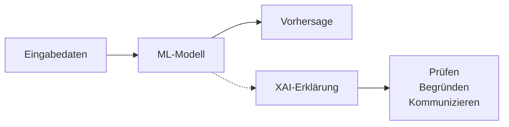
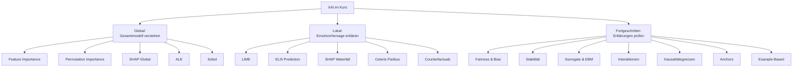
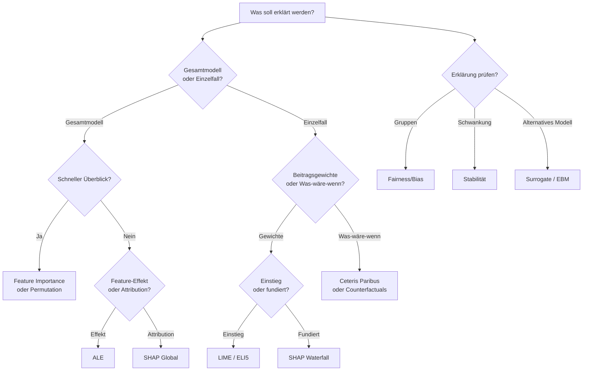

# Erklärbare KI (XAI)
{: .no_toc }

Explainable AI macht Modellvorhersagen prüfbar. Es zeigt, welche Merkmale ein Modell nutzt, wie einzelne Vorhersagen zustande kommen und wo Erklärungen selbst unsicher oder missverständlich werden.

---

## Inhaltsverzeichnis
{: .no_toc .text-delta }

1. TOC
{:toc}

---

## Einordnung

Machine-Learning-Modelle liefern oft gute Vorhersagen, aber nicht automatisch gute Begründungen. Bei einem Entscheidungsbaum lässt sich ein Pfad durch die Regeln verfolgen. Bei einem Random Forest, einem neuronalen Netz oder einem komplexen Ensemble bleibt meist nur die Input-Output-Beziehung sichtbar. XAI-Verfahren setzen genau dort an: Sie untersuchen das Modellverhalten nach dem Training und erzeugen Erklärungen, die Menschen auswerten können.


```mermaid
flowchart LR
    A["Eingabedaten"] --> B["ML-Modell"]
    B --> C["Vorhersage"]
    B -.-> D["XAI-Erklärung"]
    D --> E["Prüfen<br>Begründen<br>Kommunizieren"]
```

XAI ersetzt keine Modellbewertung. Eine plausible Erklärung kann zu einem schlechten Modell gehören, und eine unplausible Erklärung kann ein Datenproblem sichtbar machen. Im ML-Workflow liegt XAI deshalb nach Training und Evaluation: Erst wird geprüft, ob das Modell tragfähig ist; danach wird untersucht, worauf es seine Vorhersagen stützt.

> [!WARNING] Typischer Fehler<br>
> Eine XAI-Erklärung beschreibt die Logik des trainierten Modells, nicht automatisch die reale Ursache in der Welt. Wenn SHAP zeigt, dass `sex` im Titanic-Modell stark wirkt, ist damit eine Modellabhängigkeit erklärt, aber keine kausale Aussage bewiesen.

---

## Grundbegriffe

Einige Begriffe bestimmen fast jede XAI-Diskussion. **Lokal** bedeutet, dass eine einzelne Vorhersage erklärt wird, etwa warum das Modell für eine bestimmte Person eine hohe Überlebenschance prognostiziert. **Global** bedeutet, dass das Gesamtverhalten des Modells betrachtet wird, etwa welche Merkmale über viele Datenpunkte hinweg wichtig sind. **Modell-agnostisch** sind Verfahren, die nur Eingaben und Ausgaben des Modells benötigen; **modellspezifisch** sind Verfahren, die die interne Struktur eines Modelltyps ausnutzen.

| Begriff | Bedeutung im XAI-Kontext |
|---|---|
| **Black Box** | Modell mit schwer einsehbarer Entscheidungslogik, z. B. Random Forest, Gradient Boosting oder neuronales Netz |
| **Feature Attribution** | Zuordnung eines Vorhersagebeitrags zu einzelnen Merkmalen |
| **Perturbation** | Systematisches Verändern von Eingaben, um den Einfluss auf die Vorhersage zu messen |
| **Surrogate-Modell** | Einfaches Ersatzmodell, das das Verhalten eines komplexeren Modells approximiert |
| **Counterfactual** | Alternative Eingabe, bei der das Modell eine andere Entscheidung treffen würde |

Perturbation ist dabei ein zentrales Arbeitsprinzip. LIME erzeugt ähnliche Datenpunkte um einen konkreten Fall herum. Permutation Importance mischt ein Feature im Testdatensatz und misst, wie stark die Modellleistung fällt. SHAP-Varianten untersuchen gedanklich viele Feature-Kombinationen. Die gemeinsame Idee ist immer: Wenn eine gezielte Änderung die Vorhersage stark verändert, nutzt das Modell dieses Merkmal.

---

## Methodische Landkarte

Die Kursstruktur trennt XAI bewusst in zwei Stufen. Zuerst werden die Kernmethoden für den Einstieg behandelt: globale Verfahren, danach lokale Erklärungen. Darauf aufbauend folgen fortgeschrittene Fragen wie Fairness, Stabilität, interpretierbare Ersatzmodelle, Interaktionen und kausale Grenzen.


```mermaid
flowchart TD
    XAI["XAI im Kurs"] --> G["Global:<br>Gesamtmodell verstehen"]
    XAI --> L["Lokal:<br>Einzelvorhersage erklären"]
    XAI --> F["Fortgeschritten:<br>Erklärungen prüfen"]

    G --> G1["Feature Importance"]
    G --> G2["Permutation Importance"]
    G --> G3["SHAP Global"]
    G --> G4["ALE"]
    G --> G5["Sobol"]

    L --> L1["LIME"]
    L --> L2["ELI5 Prediction"]
    L --> L3["SHAP Waterfall"]
    L --> L4["Ceteris Paribus"]
    L --> L5["Counterfactuals"]

    F --> F1["Fairness & Bias"]
    F --> F2["Stabilität"]
    F --> F3["Surrogate & EBM"]
    F --> F4["Interaktionen"]
    F --> F5["Kausalitätsgrenzen"]
    F --> F6["Anchors"]
    F --> F7["Example-Based"]
```

Diese Reihenfolge ist didaktisch sinnvoll: Zuerst entsteht ein Überblick über das Modellverhalten. Danach werden einzelne Fälle untersucht. Erst dann lohnt sich die kritischere Frage, ob die Erklärung stabil, fair, kausal interpretierbar oder nur eine fragile Approximation ist.

---

## Globale Erklärungen

Globale Erklärungen beantworten die Frage, welche Merkmale das Modell insgesamt nutzt. Sie eignen sich für den ersten Modellcheck, für Fachgespräche und für die Suche nach Datenproblemen. Sie sind aber keine Einzelfallbegründung: Ein global wichtiges Feature muss für eine konkrete Person nicht den Ausschlag geben.

### Feature Importance

Feature Importance ist bei baumbasierten Modellen direkt verfügbar. Beim Random Forest misst sie, wie stark ein Merkmal über alle Bäume hinweg zur Aufteilung der Daten beiträgt. Im Titanic-Beispiel liefert das schnell eine Rangfolge, in der `sex` und `pclass` dominieren.

Die Methode ist ein guter Einstieg, weil sie ohne zusätzliche Bibliothek funktioniert und sofort lesbar ist. Ihre Grenze liegt in der Interpretation: Sie zeigt Wichtigkeit, aber keine Richtung. Außerdem kann sie bei korrelierten Merkmalen verzerrt wirken, weil sich mehrere Features dieselbe Informationsquelle teilen.

```python
feature_importance = DataFrame({
    "Feature": data_train.columns,
    "Importance": model.feature_importances_
}).sort_values("Importance", ascending=False)
```

### Permutation Importance mit ELI5

Permutation Importance misst, wie stark die Modellleistung sinkt, wenn die Werte eines Features im Testdatensatz zufällig gemischt werden. Wenn das Modell danach deutlich schlechter wird, war das Feature wichtig. ELI5 macht diese Logik mit wenig Code sichtbar und eignet sich deshalb gut für den Einstieg.

In der Praxis ist die Methode besonders nützlich, wenn eine modellunabhängige Wichtigkeitsmessung gebraucht wird. Sie bleibt aber global und erklärt nicht, warum eine einzelne Person genau diese Vorhersage erhalten hat. Bei stark korrelierten Features kann die Wichtigkeit unterschätzt werden, weil ein anderes Feature die gleiche Information teilweise ersetzt.

```python
perm = PermutationImportance(model, random_state=42).fit(data_test, target_test)
df_weights = eli5.explain_weights_df(perm, feature_names=data_train.columns.tolist())
```

### SHAP Global

SHAP ordnet Features Beiträge zu, die auf Shapley-Werten aus der Spieltheorie beruhen. Global entsteht daraus ein aggregierter Blick: Welche Features liefern im Durchschnitt große Beiträge zur Vorhersage? Anders als einfache Feature Importance kann SHAP zusätzlich zeigen, ob hohe oder niedrige Feature-Werte die Vorhersage eher erhöhen oder senken.

Für den Kurs ist SHAP der zentrale Brückenschlag zwischen mathematisch fundierter Erklärung und verständlicher Visualisierung. Der Preis ist höhere Komplexität. Teilnehmende müssen verstehen, dass die Baseline ein Modellwert ist und nicht automatisch der reale Klassenanteil.

```python
shap_explainer = shap.TreeExplainer(model)
shap_values_global = shap_explainer(data_train)
shap.plots.bar(shap_values_global[:, :, 1])
```

### ALE - Accumulated Local Effects

ALE zeigt, wie sich die Modellvorhersage verändert, wenn ein einzelnes Feature in lokalen Intervallen steigt oder fällt. Es ist eng verwandt mit Partial Dependence, vermeidet aber einen wichtigen Fehler: Es wertet nicht systematisch unrealistische Feature-Kombinationen aus, die bei korrelierten Merkmalen entstehen können.

Im Titanic-Beispiel eignet sich ALE für Fragen wie: Wie verändert sich die Überlebenschance mit dem Alter? Wie wirken die diskreten Merkmale `sex` und `pclass`? Für Einsteiger reicht ein kurzer Hinweis, dass PDP und ICE verwandte Verfahren sind. Im Kurs wird ALE bevorzugt, weil es bei korrelierten Features robuster ist.

```python
result = ale(
    X=data_train,
    model=model,
    feature=["age"],
    feature_type="continuous",
    grid_size=20,
)
```

### Sobol-Indizes

Sobol-Indizes stammen aus der globalen Sensitivitätsanalyse. Sie zerlegen die Varianz der Modellvorhersagen in Anteile, die einzelnen Features und deren Interaktionen zugeschrieben werden. Im Kurs ist Sobol als Vertiefung einzuordnen, nicht als Einstiegsmethode.

Die Methode ist relevant, wenn nicht nur die Stärke einzelner Features interessiert, sondern auch deren Wechselwirkungen. Sie erfordert viele Modellaufrufe und eine saubere Definition der Feature-Bereiche. Bei kategorischen Merkmalen wie `sex` oder `pclass` muss zusätzlich darauf geachtet werden, dass generierte Werte wieder realistisch auf Kategorien abgebildet werden.

---

## Lokale Erklärungen

Lokale Erklärungen beantworten, warum eine konkrete Vorhersage entstanden ist. Im Titanic-Beispiel werden dafür Rose und Jack als bewusst einfache Testpersonen verwendet. Das ist didaktisch stark, weil die Erklärungen sofort mit Domänenwissen abgeglichen werden können: Geschlecht und Passagierklasse sollten im Modell eine sichtbare Rolle spielen.

### LIME

LIME trainiert ein einfaches lokales Ersatzmodell um den zu erklärenden Datenpunkt. Dazu werden ähnliche Datenpunkte erzeugt, vom Black-Box-Modell bewertet und nach Nähe zum Original gewichtet. Die Koeffizienten des lokalen Ersatzmodells liefern dann die Erklärung.

LIME ist für Einsteiger gut zugänglich, weil die Idee anschaulich ist: In der unmittelbaren Umgebung eines Falls wird ein einfaches Modell gebaut. Die Grenze liegt in der Stabilität. Kleine Änderungen am Sampling oder am Seed können die lokale Erklärung verändern, besonders wenn Features korreliert oder Datenpunkte am Rand der Datenverteilung liegen.

```python
lime_explainer = LimeTabularExplainer(
    data_train.values,
    feature_names=data_train.columns.tolist(),
    class_names=["Not Survived", "Survived"],
    mode="classification",
)

rose_lime_exp = lime_explainer.explain_instance(
    rose.iloc[0].values,
    model.predict_proba,
    num_features=5,
)
```

### ELI5 Prediction

ELI5 kann neben Permutation Importance auch einzelne Vorhersagen aufschlüsseln. Die Darstellung ist weniger mächtig als SHAP, aber für einen ersten lokalen Blick oft ausreichend. Der Nutzen liegt in der niedrigen Einstiegshürde: Feature-Beiträge werden tabellarisch sichtbar, ohne dass zunächst Shapley-Werte erklärt werden müssen.

Grenze: Je nach Modell arbeitet ELI5 auf internen Skalen wie Log-Odds. Das muss erklärt werden, sonst werden Gewichte schnell mit Prozentpunkten verwechselt.

### SHAP lokal

Lokale SHAP-Erklärungen zeigen, wie sich die Vorhersage von einer Baseline zur konkreten Modellvorhersage aufbaut. Waterfall Plots sind dafür besonders geeignet: Positive Beiträge schieben die Vorhersage nach oben, negative nach unten.

Im Titanic-Beispiel wird sichtbar, dass Rose vor allem durch `sex=weiblich` und `pclass=1` eine höhere Überlebenschance erhält, während Jack durch `sex=männlich` und `pclass=3` nach unten gedrückt wird. Diese Lesart ist verständlich, solange klar bleibt: SHAP erklärt die Modellrechnung, nicht die historische Realität.

```python
rose_shap = shap_explainer(rose)
shap.plots.waterfall(rose_shap[0, :, 1])
```

### InterpretML

InterpretML bündelt mehrere XAI-Verfahren unter einer einheitlichen API und bietet interaktive Darstellungen. Im Kurs wird es vor allem genutzt, um lokale SHAP-basierte Erklärungen für Rose und Jack vergleichbar darzustellen.

Für den Einstieg ist InterpretML nicht zwingend nötig. Der Mehrwert entsteht, wenn Erklärungen explorativ untersucht oder in einem Dashboard präsentiert werden sollen. Für einfache Demonstrationen ist der Setup-Aufwand höher als bei LIME oder direktem SHAP.

### Ceteris Paribus

Ceteris-Paribus-Analysen variieren ein Feature, während alle anderen gleich bleiben. Damit beantworten sie eine leicht verständliche Frage: Was passiert mit der Vorhersage, wenn Jack in einer anderen Klasse gereist wäre? Oder wenn Rose ein anderes Alter hätte?

Die Methode ist didaktisch stark, weil sie direkt an Was-wäre-wenn-Fragen anschließt. Sie darf aber nicht mit echter Kausalität verwechselt werden. Wenn das Modell bei geänderter Passagierklasse anders vorhersagt, heißt das nicht, dass eine reale Person durch diese Änderung zwangsläufig dasselbe historische Ergebnis erfahren hätte.

### Counterfactual Explanations

Counterfactuals suchen minimale Änderungen, die die Modellentscheidung kippen. Im Titanic-Beispiel wird für Jack gesucht, welche Kombinationen die prognostizierte Überlebenschance über 50 Prozent heben würden. Das macht die Modellgrenze verständlich: Welche Eigenschaften müssten anders sein, damit das Modell anders entscheidet?

Fortgeschritten wird diese Methode erst, wenn realistische Nebenbedingungen einbezogen werden. Nicht jedes Feature ist veränderbar, und nicht jede rechnerisch minimale Änderung ist fachlich sinnvoll. Gerade sensitive Merkmale wie Geschlecht dürfen nicht als Handlungsempfehlung missverstanden werden.

> [!IMPORTANT] Counterfactuals richtig lesen<br>
> Ein Counterfactual zeigt, welche Eingabe das Modell anders bewerten würde. Es ist keine Empfehlung, eine reale Eigenschaft zu ändern, und kein Beweis für eine kausale Wirkung.

---

## Fortgeschrittene XAI-Themen

Die fortgeschrittenen XAI-Themen erweitern den Einstieg um Fragen, die in realen Projekten häufig wichtiger sind als eine weitere Visualisierung. Die zentrale Frage verschiebt sich: Nicht nur "Was sagt die Erklärung?", sondern "Ist diese Erklärung belastbar, fair und korrekt interpretierbar?"

### Fairness und Bias

Fairness-Analysen prüfen, ob Modellleistung und Modellentscheidungen zwischen Gruppen unterschiedlich ausfallen. Beim Titanic-Datensatz sind `sex` und `pclass` naheliegende Analyseachsen, weil sie im Modell stark wirken. Ein Vergleich von Selection Rate, Accuracy oder Fehlerraten zeigt, ob das Modell Gruppen systematisch verschieden behandelt.

XAI macht solche Muster sichtbar, bewertet sie aber nicht automatisch moralisch oder rechtlich. In historischen Daten können reale Ungleichheiten enthalten sein; ein Modell kann diese reproduzieren. Für Unterricht und Projektarbeit ist genau diese Unterscheidung wichtig: Erklärbarkeit zeigt die Abhängigkeit, Fairness bewertet ihre Tragfähigkeit.

### Robustheit und Stabilität

Eine Erklärung ist nur dann brauchbar, wenn sie nicht bei jedem Seed oder Split stark kippt. Deshalb werden LIME-Gewichte über mehrere Läufe und SHAP-Ergebnisse über verschiedene Train-Test-Splits verglichen. Wenn `sex` und `pclass` stabil oben bleiben, ist diese Kernaussage robuster als die genaue Rangfolge schwacher Features wie `sibsp` oder `parch`.

In Trainings zeigt sich häufig, dass Teilnehmende die erste Erklärung als endgültige Wahrheit lesen. Stabilitätschecks brechen diese Gewohnheit. Sie machen sichtbar, welche Aussagen zuverlässig sind und welche eher Artefakte eines konkreten Laufs.

### Surrogate Models und EBM

Ein globales Surrogate-Modell approximiert die Vorhersagen einer Black Box mit einem einfacheren Modell, etwa einem flachen Decision Tree. So entsteht eine lesbare Annäherung an das Modellverhalten. Die Qualität dieses Surrogates muss aber gegen die Black-Box-Vorhersagen gemessen werden; sonst erklärt der Baum nur sich selbst.

Explainable Boosting Machines (EBM) gehen einen anderen Weg. Sie sind von Anfang an interpretierbare Modelle, die Feature-Effekte additiv lernen und trotzdem oft gute Leistung erreichen. Damit wird eine wichtige Projektfrage sichtbar: Nicht jedes Problem braucht eine Black Box plus XAI. Manchmal ist ein direkt interpretierbares Modell die bessere Entscheidung.

### SHAP Interaction Values

Feature-Interaktionen beschreiben, dass zwei Merkmale gemeinsam anders wirken als isoliert. Im Titanic-Beispiel ist `sex x pclass` fachlich plausibel: Geschlecht und Klasse prägen zusammen das Muster der Überlebenswahrscheinlichkeit. SHAP Interaction Values machen solche gemeinsamen Beiträge sichtbar.

Diese Analyse ist fortgeschritten, weil die Interpretation schnell komplex wird. Sie eignet sich, wenn einfache Feature-Ranglisten nicht mehr reichen oder wenn Fachwissen nahelegt, dass Merkmale zusammen wirken.

### Kausalität und Korrelation

XAI-Erklärungen sind keine Kausalmodelle. SHAP, LIME, ALE und Feature Importance zeigen, wie ein trainiertes Modell seine Inputs nutzt. Sie beantworten nicht, was in der realen Welt passiert wäre, wenn ein Merkmal geändert worden wäre.

Diese Grenze lässt sich mit einer Proxy-Frage demonstrieren: Was passiert, wenn ein sensibles Feature entfernt wird? Häufig bleiben Stellvertretermerkmale im Datensatz, die ähnliche Information tragen. Ein Modell ohne `sex` kann also weiterhin geschlechtsnahe Muster über andere Variablen nutzen. Genau deshalb reicht "Feature entfernen" als Fairness-Maßnahme selten aus.

### Anchors

Anchors sind lokale Wenn-dann-Regeln. Sie suchen Bedingungen, unter denen eine Vorhersage mit hoher Wahrscheinlichkeit stabil bleibt, etwa: Wenn `sex=weiblich` und `pclass=1`, dann prognostiziert das Modell mit hoher Präzision "überlebt". Anders als LIME oder SHAP liefern Anchors keine Gewichte, sondern Regeln.

Regeln sind für Fachbereiche oft leichter lesbar als Balkendiagramme. Ihre Grenze liegt in der Abdeckung: Eine präzise Regel kann nur für einen kleinen Teil des Datenraums gelten. Deshalb werden Precision und Coverage zusammen betrachtet.

### Beispielbasierte Erklärungen

Example-Based Explanations erklären nicht über Gewichte, sondern über ähnliche Fälle. Ein k-nearest-neighbors-Vergleich kann zeigen, welchen Trainingsfällen Rose oder Jack ähneln. Prototypen zeigen repräsentative Fälle einer Klasse, Gegenbeispiele zeigen ähnliche Fälle mit anderer Vorhersage.

Dieser Ansatz ist intuitiv, weil Menschen häufig über Vergleiche argumentieren: "Dieser Fall ähnelt jenen Fällen." Die Grenze ist die gewählte Distanzmetrik. Wenn Skalierung, Kodierung oder Feature-Auswahl schlecht gewählt sind, werden scheinbar ähnliche Fälle fachlich unpassend.

---

## Framework- und Methodenvergleich

Die folgende Tabelle ordnet die im Kurs eingesetzten Methoden nach Einsatzbereich. Die Sterne beschreiben nicht wissenschaftliche Qualität, sondern Einstiegshürde im Unterricht.

| Methode | Scope | Typischer Nutzen | Grenze | Einstieg |
|---|---|---|---|---|
| Feature Importance | Global | Schnelle Rangfolge bei Tree-Modellen | Keine Richtung, Verzerrung bei Korrelation | sehr leicht |
| Permutation Importance | Global | Modellunabhängige Wichtigkeit über Leistungsverlust | Schwierig bei korrelierten Features | leicht |
| SHAP Global | Global | Aggregierte Attribution mit Richtung | Konzeptuell anspruchsvoller | mittel |
| ALE | Global | Feature-Effekte bei Korrelation robuster darstellen | Weniger bekannt, Interpretation erfordert Kontext | mittel |
| Sobol | Global | Varianz und Interaktionen untersuchen | Rechenintensiv, abstrakt | schwer |
| LIME | Lokal | Einzelne Vorhersage intuitiv erklären | Instabil bei Sampling und Randfällen | leicht |
| ELI5 Prediction | Lokal | Schnelle lokale Beitragsdarstellung | Interne Skalen können verwirren | leicht |
| SHAP Waterfall | Lokal | Fundierte Einzelfall-Erklärung | Baseline und Klassenbezug müssen klar sein | mittel |
| Ceteris Paribus | Lokal | Was-wäre-wenn-Fragen beantworten | Keine kausale Aussage | leicht |
| Counterfactuals | Lokal | Entscheidungsgrenze sichtbar machen | Änderbarkeit und Plausibilität nötig | leicht bis mittel |
| Fairness/Bias | Prüfung | Gruppenunterschiede sichtbar machen | Normative Bewertung bleibt extern | mittel |
| Stabilitätschecks | Prüfung | Belastbarkeit von Erklärungen prüfen | Mehr Rechenzeit und Wiederholungen | mittel |
| Surrogate/EBM | Modellstrategie | Interpretierbare Alternative oder Approximation | Fidelity muss gemessen werden | mittel |
| Anchors | Lokal | Lesbare Wenn-dann-Regeln | Präzision ohne Coverage reicht nicht | mittel |
| Example-Based | Lokal | Ähnliche Fälle, Prototypen, Gegenbeispiele | Abhängig von Distanzmetrik | mittel |

---

## Entscheidungshilfe


```mermaid
flowchart TD
    START["Was soll erklärt werden?"] --> Q1{"Gesamtmodell<br>oder Einzelfall?"}
    Q1 -->|"Gesamtmodell"| G1{"Schneller Überblick?"}
    Q1 -->|"Einzelfall"| L1{"Beitragsgewichte<br>oder Was-wäre-wenn?"}

    G1 -->|"Ja"| FI["Feature Importance<br>oder Permutation"]
    G1 -->|"Nein"| G2{"Feature-Effekt<br>oder Attribution?"}
    G2 -->|"Effekt"| ALE["ALE"]
    G2 -->|"Attribution"| SHAPG["SHAP Global"]

    L1 -->|"Gewichte"| L2{"Einstieg<br>oder fundiert?"}
    L2 -->|"Einstieg"| LIME["LIME / ELI5"]
    L2 -->|"Fundiert"| SHAPL["SHAP Waterfall"]
    L1 -->|"Was-wäre-wenn"| CP["Ceteris Paribus<br>oder Counterfactuals"]

    START --> Q2{"Erklärung prüfen?"}
    Q2 -->|"Gruppen"| FAIR["Fairness/Bias"]
    Q2 -->|"Schwankung"| STAB["Stabilität"]
    Q2 -->|"Alternatives Modell"| EBM["Surrogate / EBM"]
```

In Kursprojekten reicht für den Einstieg meist eine Kombination aus Feature Importance, Permutation Importance, LIME und SHAP Waterfall. Für belastbarere Aussagen kommen ALE, Counterfactuals und Stabilitätschecks hinzu. Sobald Modelle in sensiblen Kontexten eingesetzt werden, gehören Fairness-Analysen und Kausalitätsgrenzen zur Mindestdiskussion.

---

## Best Practices

XAI sollte nicht als einzelner Plot am Ende einer Analyse erscheinen. Sinnvoller ist ein kleiner Prüfablauf: zuerst globale Treiber identifizieren, dann zwei bis drei Einzelfälle erklären, anschließend die Erklärung gegen Fachwissen und Stabilität prüfen. Bei Titanic heißt das konkret: Wenn `sex` und `pclass` dominieren, passt das zum historischen Kontext; wenn ein zufälliges oder technisch erzeugtes Merkmal oben steht, wäre ein Datenleck zu vermuten.

Eine einzelne Methode reicht selten. Feature Importance liefert Tempo, SHAP liefert Richtung, LIME liefert einen intuitiven lokalen Einstieg, Ceteris Paribus macht Modellgrenzen als Was-wäre-wenn-Frage sichtbar. Widersprechen sich Methoden, ist das kein Fehler der Dokumentation, sondern ein Analysehinweis.

> [!TIP] Robuste XAI-Auswertung<br>
> Eine Erklärung wird belastbarer, wenn globale und lokale Verfahren dieselbe Kernaussage stützen und diese Aussage über mehrere Seeds oder Splits stabil bleibt.

---

## Grenzen von XAI

Erklärbarkeit kann Vertrauen begründen, aber auch falsches Vertrauen erzeugen. Besonders riskant sind drei Verwechslungen: Modelllogik mit Kausalität, Feature-Wichtigkeit mit ethischer Zulässigkeit und lokale Erklärungen mit globaler Wahrheit. Das Titanic-Beispiel ist dafür gut geeignet, weil die wichtigsten Merkmale fachlich plausibel sind und zugleich zeigen, wie schnell sensible Merkmale in Vorhersagen eingehen.

Nicht geeignet ist XAI als Ersatz für Datenprüfung, Modellvalidierung oder fachliche Verantwortung. Ein gut erklärtes Modell kann unfair sein. Ein faires Modell kann schwer erklärbar sein. Und ein erklärbares Modell kann trotzdem schlecht generalisieren.

---

## Weiterführende Ressourcen

| Thema | Ressource |
|---|---|
| LIME | [github.com/marcotcr/lime](https://github.com/marcotcr/lime) |
| SHAP | [shap.readthedocs.io](https://shap.readthedocs.io/) |
| ELI5 | [eli5.readthedocs.io](https://eli5.readthedocs.io/) |
| InterpretML und EBM | [interpret.ml](https://interpret.ml/) |
| ALE | [PyALE](https://github.com/DanaJomar/PyALE) |
| Sobol/SALib | [salib.readthedocs.io](https://salib.readthedocs.io/) |
| Anchors und Counterfactuals | [alibi-explain.readthedocs.io](https://alibi-explain.readthedocs.io/) |

Zentrale Paper: Ribeiro et al. (2016) zu LIME, Lundberg & Lee (2017) zu SHAP und Apley & Zhu (2020) zu ALE.

---

## Zusammenfassung

> [!SUCCESS] Kernpunkte<br>
> XAI erklärt Modellverhalten aus mehreren Perspektiven. Für den Einstieg reichen globale Wichtigkeiten, LIME und lokale SHAP-Erklärungen; für belastbare Projektarbeit kommen ALE, Counterfactuals, Fairness, Stabilität und Kausalitätsgrenzen hinzu. Entscheidend ist nicht die Anzahl der Plots, sondern ob die Erklärung fachlich plausibel, stabil und korrekt eingeordnet ist.

## Abgrenzung zu verwandten Dokumenten

| Thema | Abgrenzung |
|---|---|
| [Modellauswahl](./modeling/modellauswahl.html) | Modellauswahl entscheidet, ob ein interpretierbares Modell von Anfang an genügt; XAI erklärt zusätzlich oder nachträglich trainierte Modelle. |
| [Random Forest](./modeling/random-forest.html) | Random Forest behandelt Modelllogik und Feature Importance; XAI vergleicht diese Erklärung mit modell-agnostischen und lokalen Verfahren. |
| [Bewertung Klassifizierung](./evaluate/bewertung_klassifizierung.html) | Klassifikationsmetriken bewerten Vorhersagequalität; XAI untersucht, welche Merkmale die Vorhersagen treiben. |
| [Hyperparameter-Tuning](./evaluate/hyperparameter_tuning.html) | Tuning optimiert Modellparameter; XAI prüft, ob das optimierte Modell fachlich nachvollziehbar bleibt. |

---

**Version:** 1.3<br>
**Stand:** April 2026<br>
**Kurs:** Machine Learning. Verstehen. Anwenden. Gestalten.
