# Methoden & Frameworks
{: .no_toc }

> **Explainable AI (XAI) umfasst Methoden und Techniken, die ML-Modelle für Menschen verständlich und nachvollziehbar machen.** 

---

## Inhaltsverzeichnis
{: .no_toc .text-delta }

1. TOC
{:toc}

---

## Einführung in XAI

### Was ist Explainable AI?

Explainable AI (XAI) ist ein Ansatz der künstlichen Intelligenz, der darauf abzielt, dass die Funktionsweise und Entscheidungen von ML-Modellen für Menschen verständlich und nachvollziehbar sind.

```mermaid
flowchart TD
    subgraph Problem["🔲 Das Black-Box-Problem"]
        INPUT[/"Eingabedaten"/]
        MODEL[("ML-Modell<br/>(Black Box)")]
        OUTPUT[/"Vorhersage"/]
        INPUT --> MODEL --> OUTPUT
    end
    
    subgraph Lösung["✅ XAI-Lösung"]
        INPUT2[/"Eingabedaten"/]
        MODEL2[("ML-Modell")]
        OUTPUT2[/"Vorhersage"/]
        EXPLAIN["📊 Erklärung:<br/>Welche Features waren wichtig?<br/>Warum diese Entscheidung?"]
        INPUT2 --> MODEL2 --> OUTPUT2
        MODEL2 -.-> EXPLAIN
    end
    
    Problem --> Lösung
    
    style Problem fill:#ffcccc,stroke:#cc0000
    style Lösung fill:#ccffcc,stroke:#00cc00
    style EXPLAIN fill:#ffffcc,stroke:#cccc00
```

### Warum ist XAI wichtig?

Die Umsetzung von XAI-Methoden trägt dazu bei, das Vertrauen in KI-Systeme zu erhöhen, indem sie Transparenz und Nachvollziehbarkeit in den Entscheidungsprozess bringen.

| Bereich | Bedeutung von XAI |
|---------|-------------------|
| **Medizin** | Ärzte müssen verstehen, warum ein Modell eine Diagnose vorschlägt |
| **Finanzwesen** | Kreditentscheidungen müssen gegenüber Kunden begründbar sein |
| **Rechtswesen** | Algorithmen müssen den Anforderungen an Fairness und Nachvollziehbarkeit genügen |
| **Compliance** | DSGVO und andere Regularien fordern Erklärbarkeit automatisierter Entscheidungen |

---

## Grundlegende Konzepte

Bevor wir die einzelnen XAI-Methoden betrachten, sollten einige zentrale Begriffe verstanden werden.

**Wichtige Fachbegriffe für dieses Kapitel:**

| **Begriff**           | **Bedeutung**                                                                                                               |
| --------------------- | --------------------------------------------------------------------------------------------------------------------------- |
| **Approximation**     | Annäherung – ein vereinfachtes Modell, das das Verhalten eines komplexen Modells _ungefähr_ nachbildet                      |
| **Modell-agnostisch** | Unabhängig vom Modelltyp – die Methode funktioniert bei jedem ML-Modell, egal ob neuronales Netz, Random Forest oder andere |
| **Feature**           | Ein Eingabemerkmal des Modells (z.B. Alter, Einkommen, Geschlecht)                                                          |
| **Scope**             | Geltungsbereich – ob eine Erklärung für eine einzelne Vorhersage (lokal) oder das gesamte Modell (global) gilt              |
### Black-Box-Modelle

Ein **Black-Box-Modell** ist ein ML-Modell, dessen interne Entscheidungslogik nicht direkt einsehbar oder interpretierbar ist. Man sieht nur Input und Output, aber nicht *wie* die Entscheidung zustande kommt.

| Modelltyp | Transparenz | Beispiele |
|-----------|-------------|-----------|
| **White-Box** | Vollständig interpretierbar | Lineare Regression, Decision Trees, Regelbasierte Systeme |
| **Grey-Box** | Teilweise interpretierbar | Ensemble-Methoden mit Feature Importance |
| **Black-Box** | Nicht direkt interpretierbar | Tiefe neuronale Netze, komplexe Ensemble-Modelle |

XAI-Methoden machen Black-Box-Modelle nachvollziehbar, ohne deren Architektur zu verändern.

### Perturbierte Samples

**Perturbierte Samples** sind Datenpunkte, die absichtlich leicht verändert (gestört) wurden. Der Begriff kommt vom lateinischen *perturbare* (durcheinanderbringen, stören).

```mermaid
flowchart LR
    subgraph Original["📊 Original-Datenpunkt"]
        O["Alter: 25<br/>Klasse: 1<br/>Geschlecht: m"]
    end
    
    subgraph Perturbiert["🔀 Perturbierte Samples"]
        P1["Alter: 30<br/>Klasse: 1<br/>Geschlecht: m"]
        P2["Alter: 25<br/>Klasse: 2<br/>Geschlecht: m"]
        P3["Alter: 25<br/>Klasse: 1<br/>Geschlecht: w"]
        P4["Alter: 22<br/>Klasse: 3<br/>Geschlecht: m"]
    end
    
    Original -->|"Systematische<br/>Variation"| Perturbiert
    
    style Original fill:#e3f2fd,stroke:#1565c0
    style Perturbiert fill:#fff3e0,stroke:#e65100
```



**Grundprinzip in XAI:** Man verändert systematisch einzelne Features eines Inputs und beobachtet, wie sich die Modellvorhersage ändert. Große Änderungen im Output deuten auf wichtige Features hin.

**XAI-Methoden, die Perturbation nutzen:**

| Methode | Art der Perturbation | Zweck |
|---------|---------------------|-------|
| **LIME** | Zufällige Variation um einen Datenpunkt | Lokales Surrogate-Modell trainieren |
| **KernelSHAP** | Systematisches Maskieren von Feature-Kombinationen | Shapley-Werte approximieren |
| **Permutation Importance** | Zufälliges Durchmischen einzelner Features | Globale Feature-Wichtigkeit messen |
| **Occlusion Sensitivity** | Verdecken von Bildbereichen | Wichtige Regionen in Bildern identifizieren |

**Vorteil der Perturbation:** Modell-Agnostik – man braucht keinen Zugriff auf interne Gewichte, nur auf die Input-Output-Beziehung.

### Surrogate-Modelle

Ein **Surrogate-Modell** (auch Ersatzmodell) ist ein einfaches, interpretierbares Modell, das trainiert wird, um die Vorhersagen eines komplexen Black-Box-Modells nachzuahmen.

**Alltagsanalogie:** Stellen Sie sich einen erfahrenen Arzt vor, der Diagnosen stellt, aber nicht erklären kann, *warum* er zu diesem Schluss kommt – er "spürt" es einfach nach 30 Jahren Erfahrung. Ein Surrogate-Modell wäre wie ein Praktikant, der den Arzt bei vielen Diagnosen beobachtet und dann einfache Regeln ableitet: "Wenn Symptom A und B vorliegen, diagnostiziert der Arzt meist Krankheit X." Die Regeln des Praktikanten sind nicht perfekt, aber sie machen das Verhalten des Arztes nachvollziehbar.

```mermaid
flowchart TD
    subgraph BlackBox["🔲 Black-Box-Modell"]
        BB["Neuronales Netz<br/>XGBoost<br/>Random Forest"]
    end
    
    subgraph Surrogate["📐 Surrogate-Modell"]
        SU["Lineare Regression<br/>Decision Tree<br/>Regelbasiertes System"]
    end
    
    DATA["Eingabedaten"] --> BlackBox
    BlackBox -->|"Vorhersagen als<br/>Trainingsdaten"| Surrogate
    Surrogate -->|"Interpretation der<br/>Koeffizienten/Regeln"| EXPLAIN["📊 Erklärung"]
    
    style BlackBox fill:#ffcccc,stroke:#cc0000
    style Surrogate fill:#ccffcc,stroke:#00cc00
    style EXPLAIN fill:#ffffcc,stroke:#cccc00
```



| Surrogate-Typ | Scope | Methode |
|---------------|-------|---------|
| **Global** | Gesamtes Modell | Ein Surrogate erklärt alle Vorhersagen |
| **Lokal** | Einzelne Vorhersage | LIME trainiert ein Surrogate nur für einen Datenpunkt |

**Wichtig:** Das Surrogate-Modell erklärt nicht das Original-Modell selbst, sondern dessen *Verhalten* – die Erklärung ist eine Approximation.

---

## XAI-Ansätze im Überblick

```mermaid
flowchart TD
    XAI["🔍 XAI-Ansätze"]
    
    XAI --> IM["📐 Interpretable Models"]
    XAI --> LE["🎯 Local Explanation"]
    XAI --> GE["🌍 Global Explanation"]
    
    IM --> IM1["Decision Trees"]
    IM --> IM2["Lineare Regression"]
    IM --> IM3["Regelbasierte Systeme"]
    
    LE --> LE1["LIME"]
    LE --> LE2["SHAP (lokal)"]
    LE --> LE3["Break-Down Analyse"]
    
    GE --> GE1["Feature Importance"]
    GE --> GE2["SHAP Summary"]
    GE --> GE3["Partial Dependence"]
    
    style XAI fill:#e1f5fe,stroke:#01579b
    style IM fill:#fff3e0,stroke:#e65100
    style LE fill:#e8f5e9,stroke:#2e7d32
    style GE fill:#fce4ec,stroke:#c2185b
```



### Interpretable Models

Verwendung von ML-Modellen, die von Grund auf so konzipiert sind, dass sie erklärbar sind:

- **Decision Trees**: Klare Entscheidungsregeln, visuell darstellbar
- **Lineare Regression**: Koeffizienten zeigen direkt den Einfluss jedes Features
- **Regelbasierte Systeme**: Explizite IF-THEN-Regeln

### Local Explanation

Erklärung individueller Vorhersagen durch Analyse der wichtigsten Features und ihrer Ausprägungen:

> **Beispiel**: Warum wurde für Passagier X vorhergesagt, dass er überlebt?
> - Geschlecht: weiblich → +45% Überlebenschance
> - Klasse: 1. Klasse → +20% Überlebenschance
> - Alter: 22 Jahre → +5% Überlebenschance

### Global Explanation

Ganzheitliche Erklärung der Prognosefähigkeit eines ML-Modells:

- **Feature Importance**: Welche Merkmale sind insgesamt am wichtigsten?
- **Partial Dependence**: Wie beeinflusst ein Feature die Vorhersage über alle Datenpunkte?
- **Accumulated Local Dependence**: Robustere Alternative zu Partial Dependence

---

## SHAP – SHapley Additive exPlanations

### Konzept

SHAP basiert auf der Spieltheorie und dem Shapley-Wert, der ursprünglich zur fairen Verteilung von Gewinnen in Koalitionen entwickelt wurde.

```mermaid
flowchart LR
    subgraph Spieltheorie["🎲 Spieltheorie-Analogie"]
        P1["Spieler A"]
        P2["Spieler B"]
        P3["Spieler C"]
        GEWINN["💰 Gewinn"]
        P1 & P2 & P3 --> GEWINN
    end
    
    subgraph ML["🤖 ML-Kontext"]
        F1["Feature 1<br/>(Alter)"]
        F2["Feature 2<br/>(Geschlecht)"]
        F3["Feature 3<br/>(Klasse)"]
        PRED["📊 Vorhersage"]
        F1 & F2 & F3 --> PRED
    end
    
    Spieltheorie -.->|"Übertragung"| ML
    
    style Spieltheorie fill:#e3f2fd,stroke:#1565c0
    style ML fill:#f3e5f5,stroke:#7b1fa2
```



### Berechnung des Shapley-Werts

Der Shapley-Wert berücksichtigt alle möglichen Kombinationen von Features und berechnet den durchschnittlichen Beitrag jedes Features:

1. Betrachte alle möglichen Teilmengen von Features
2. Berechne für jede Teilmenge die Vorhersage mit und ohne das Feature
3. Bilde den gewichteten Durchschnitt über alle Kombinationen

### SHAP-Visualisierungen

| Visualisierung      | Beschreibung                                  | Scope  |
| ------------------- | --------------------------------------------- | ------ |
| **Waterfall Plot**  | Zeigt schrittweise den Beitrag jedes Features | Lokal  |
| **Force Plot**      | Kompakte Darstellung der Feature-Beiträge     | Lokal  |
| **Summary Plot**    | Übersicht über alle Features und Datenpunkte  | Global |
| **Dependence Plot** | Einfluss eines Features auf die Vorhersage    | Global |

### Code-Beispiel

```python
import shap

# SHAP Explainer erstellen
explainer = shap.TreeExplainer(model)

# SHAP-Werte berechnen
shap_values = explainer(data_test)

# Waterfall Plot für einzelne Vorhersage
shap.plots.waterfall(shap_values[0])

# Summary Plot für globale Übersicht
shap.plots.summary(shap_values)
```

---

## LIME – Local Interpretable Model-agnostic Explanations

### Konzept

LIME erklärt einzelne Vorhersagen, indem es ein einfaches, interpretierbares Modell lokal um die zu erklärende Instanz herum trainiert.


### Funktionsweise

1. **Sample-Generierung**: Erzeuge ähnliche Datenpunkte durch Perturbation
2. **Gewichtung**: Gewichte Samples nach Nähe zur Original-Instanz
3. **Lokales Modell**: Trainiere ein interpretierbares Modell (z.B. lineare Regression)
4. **Interpretation**: Die Koeffizienten des lokalen Modells erklären die Vorhersage

### Code-Beispiel

```python
from lime.lime_tabular import LimeTabularExplainer

# LIME Explainer erstellen
explainer = LimeTabularExplainer(
    training_data=data_train.values,
    feature_names=data_train.columns.tolist(),
    class_names=['Nicht überlebt', 'Überlebt'],
    mode='classification'
)

# Erklärung für einzelne Instanz
explanation = explainer.explain_instance(
    data_row=rose.values[0],
    predict_fn=model.predict_proba,
    num_features=5
)

# Visualisierung
explanation.show_in_notebook()
```

---

## ELI5 – Explain Like I'm 5

### Konzept

ELI5 ist ein Framework, das Erklärungen so einfach wie möglich darstellt – wie für ein 5-jähriges Kind. Es fokussiert auf Permutation Importance.

### Permutation Importance

Die Methode misst die Wichtigkeit eines Features, indem sie dessen Werte zufällig permutiert und den Einfluss auf die Modellleistung beobachtet:


### Code-Beispiel

```python
import eli5
from eli5.sklearn import PermutationImportance

# Permutation Importance berechnen
perm = PermutationImportance(model, random_state=42)
perm.fit(data_test, target_test)

# HTML-Darstellung
eli5.show_weights(perm, feature_names=data_test.columns.tolist())

# Feature-Gewichte des Modells
eli5.show_weights(model, feature_names=data_train.columns.tolist())
```

---

## InterpretML – Microsoft Framework

### Konzept

InterpretML ist Microsofts umfassendes Open-Source-Framework für Explainable AI, das sowohl interpretierbare Modelle als auch Black-Box-Erklärungen unterstützt.

### Kernfunktionen

| Funktion | Beschreibung |
|----------|--------------|
| **Explainable Boosting Machine (EBM)** | Interpretierbares Modell mit Boosting-Performance |
| **SHAP Kernel** | Black-Box-Erklärungen für beliebige Modelle |
| **Interaktive Dashboards** | Web-basierte Visualisierungen |
| **Unified API** | Einheitliche Schnittstelle für verschiedene Erklärungsmethoden |

### Code-Beispiel

```python
from interpret import show
from interpret.blackbox import ShapKernel

# SHAP Kernel Explainer
shap_explainer = ShapKernel(
    predict_fn=model.predict_proba,
    data=data_train,
    feature_names=data_train.columns.tolist()
)

# Lokale Erklärung
local_explanation = shap_explainer.explain_local(
    X=rose,
    y=None,
    name="Rose"
)

# Interaktives Dashboard
show(local_explanation)
```

---

## Feature Importance (Random Forest)

### Konzept

Random Forest berechnet die Feature Importance basierend darauf, wie stark jedes Feature zur Reduktion der Unreinheit (Impurity) in den Entscheidungsbäumen beiträgt.

### Vorteile

- **Schnell**: Direkt im Training berechnet, kein zusätzlicher Aufwand
- **Integriert**: In scikit-learn bereits enthalten
- **Einfach interpretierbar**: Direkte Rangfolge der Features

### Einschränkungen

- Zeigt keine **Richtung** des Einflusses (positiv/negativ)
- Kann bei korrelierten Features irreführend sein
- Nur für Tree-basierte Modelle verfügbar

### Code-Beispiel

```python
import pandas as pd
import plotly.express as px

# Feature Importance extrahieren
feature_importance = pd.DataFrame({
    'Feature': data_train.columns,
    'Importance': model.feature_importances_
}).sort_values('Importance', ascending=False)

# Visualisierung
fig = px.bar(
    feature_importance,
    x='Importance',
    y='Feature',
    orientation='h',
    title='Feature Importance',
    color='Importance',
    color_continuous_scale='viridis'
)
fig.show()
```

---

## Framework-Vergleich

### Übersichtstabelle

| Framework | Stärken | Schwächen | Einsteigerfreundlichkeit |
|-----------|---------|-----------|--------------------------|
| **LIME** | Sehr intuitiv, gute Visualisierung, schnell lokal | Nur lokale Erklärungen, kann instabil sein | ⭐⭐⭐⭐⭐ |
| **SHAP** | Theoretisch fundiert, beste Visualisierungen, lokal & global | Kann langsam sein, komplexeres Konzept | ⭐⭐⭐⭐ |
| **ELI5** | Extrem einfach, minimaler Code, schnell | Weniger Visualisierungen, weniger Features | ⭐⭐⭐⭐⭐ |
| **InterpretML** | Interaktive Dashboards, umfassend, professionell | Komplexer Setup, Overhead für einfache Aufgaben | ⭐⭐⭐ |
| **RF Importance** | Extrem schnell, in sklearn integriert | Nur Feature Importance, keine Richtung | ⭐⭐⭐⭐⭐ |

### Entscheidungshilfe

```mermaid
flowchart TD
    START["❓ Welches XAI-Framework?"]
    
    START --> Q1{"Einzelne Vorhersage<br/>oder gesamtes Modell?"}
    
    Q1 -->|"Einzelne<br/>Vorhersage"| Q2{"Schnelligkeit<br/>wichtig?"}
    Q1 -->|"Gesamtes<br/>Modell"| Q3{"Tree-basiertes<br/>Modell?"}
    
    Q2 -->|"Ja"| LIME["🔍 LIME"]
    Q2 -->|"Nein"| SHAP_L["🎯 SHAP"]
    
    Q3 -->|"Ja"| RF["🌲 RF Importance<br/>+ SHAP"]
    Q3 -->|"Nein"| Q4{"Interaktives<br/>Dashboard nötig?"}
    
    Q4 -->|"Ja"| IML["🏢 InterpretML"]
    Q4 -->|"Nein"| SHAP_G["🎯 SHAP Summary"]
    
    style START fill:#e3f2fd,stroke:#1565c0
    style LIME fill:#c8e6c9,stroke:#388e3c
    style SHAP_L fill:#c8e6c9,stroke:#388e3c
    style SHAP_G fill:#c8e6c9,stroke:#388e3c
    style RF fill:#c8e6c9,stroke:#388e3c
    style IML fill:#c8e6c9,stroke:#388e3c
```



---

## XAI-Techniken Übersicht

| XAI-Technik | Beschreibung | Bibliotheken |
|-------------|--------------|--------------|
| **LIME** | Lokale Erklärungen durch interpretierbare Surrogate-Modelle | lime, Skater |
| **SHAP** | Berechnet Feature-Beiträge basierend auf Spieltheorie | shap, Dalex |
| **Break Down** | Aufschlüsselung des Vorhersagebeitrags jeder Variable | Dalex |
| **Permutation Importance** | Ermittelt Wichtigkeit durch Feature-Permutation | ELI5, Skater |
| **Partial Dependence** | Zeigt Abhängigkeit der Vorhersage von einem Feature | Skater, Dalex |
| **Counterfactuals** | Findet alternative Eingaben zur Erklärung | Alibi-Explain |
| **Anchors** | Entdeckt Regeln, die die Vorhersage erklären | Alibi-Explain |

---

## Counterfactual Explanations

### Konzept

**Counterfactual Explanations** (kontrafaktische Erklärungen) beantworten die Frage: *"Was müsste anders sein, damit das Modell eine andere Entscheidung trifft?"*

```mermaid
flowchart LR
    subgraph Faktisch["📊 Faktische Situation"]
        F["Kreditantrag: Abgelehnt<br/>Einkommen: 35.000€<br/>Schulden: 15.000€<br/>Beschäftigung: 2 Jahre"]
    end
    
    subgraph Kontrafaktisch["✅ Counterfactual"]
        CF["Kreditantrag: Genehmigt<br/>Einkommen: 35.000€<br/>Schulden: 8.000€<br/>Beschäftigung: 2 Jahre"]
    end
    
    F -->|"Minimale<br/>Änderung"| CF
    
    style F fill:#ffcccc,stroke:#cc0000
    style CF fill:#ccffcc,stroke:#00cc00
```



### Eigenschaften guter Counterfactuals

| Eigenschaft | Beschreibung |
|-------------|--------------|
| **Minimal** | So wenig Änderungen wie möglich |
| **Plausibel** | Die Änderungen sind realistisch umsetzbar |
| **Actionable** | Der Betroffene kann die Änderungen beeinflussen |
| **Divers** | Mehrere alternative Wege zum Ziel aufzeigen |

### Anwendungsbeispiel

Das folgende Beispiel zeigt die grundlegende Verwendung. In der Praxis erfordert die Bibliothek weitere Konfiguration.

```python
from alibi.explainers import CounterFactual

# Counterfactual Explainer erstellen
cf = CounterFactual(model.predict_proba, shape=(1, n_features))

# Counterfactual für abgelehnten Kreditantrag finden
explanation = cf.explain(abgelehnter_antrag)

# Ergebnis zeigt minimale Änderungen für andere Entscheidung
# z.B.: "Reduzieren Sie Ihre Schulden um 7.000€ für eine Genehmigung"
```

**Vorteil:** Counterfactuals sind intuitiv verständlich und geben konkrete Handlungsempfehlungen.

---

## Anchors

### Konzept

**Anchors** sind Regeln, die eine Vorhersage "verankern" – sie beschreiben die *hinreichenden Bedingungen*, unter denen das Modell mit hoher Wahrscheinlichkeit dieselbe Entscheidung trifft.

```mermaid
flowchart TD
    subgraph Anchor["⚓ Anchor-Regel"]
        RULE["WENN Geschlecht = weiblich<br/>UND Klasse ≤ 2<br/>DANN Überlebt = Ja<br/>(Precision: 97%)"]
    end
    
    subgraph Anwendung["📊 Anwendung"]
        P1["Rose: weiblich, 1. Klasse → ✅"]
        P2["Mary: weiblich, 2. Klasse → ✅"]
        P3["Jack: männlich, 3. Klasse → ❓"]
    end
    
    Anchor --> Anwendung
    
    style Anchor fill:#e3f2fd,stroke:#1565c0
    style P1 fill:#c8e6c9,stroke:#388e3c
    style P2 fill:#c8e6c9,stroke:#388e3c
    style P3 fill:#ffcccc,stroke:#cc0000
```



### Vergleich der Erklärungsarten

Anchors liefern einen anderen Erklärungstyp als andere XAI-Methoden. Während LIME (siehe Abschnitt oben) numerische Gewichte liefert, die zeigen *wie stark* ein Feature wirkt, geben Anchors klare Regeln an, *wann* eine Vorhersage gilt.

| Aspekt | Gewicht-basiert (z.B. LIME) | Regel-basiert (Anchors) |
|--------|----------------------------|-------------------------|
| **Output** | "Alter hat Gewicht +0.3" | "WENN Alter < 30 DANN ..." |
| **Interpretation** | Erfordert Verständnis von Gewichten | Lesbar wie Geschäftsregel |
| **Antwort auf** | "Wie stark wirkt jedes Feature?" | "Unter welchen Bedingungen gilt diese Vorhersage?" |
| **Besonders geeignet für** | Technische Analyse | Kommunikation an Laien |

### Code-Beispiel

```python
from alibi.explainers import AnchorTabular

# Anchor Explainer erstellen
anchor_exp = AnchorTabular(
    predictor=model.predict,
    feature_names=feature_names
)
anchor_exp.fit(X_train)

# Anchor für einzelne Instanz
explanation = anchor_exp.explain(rose.values)

# Ausgabe: "IF sex = female AND pclass <= 2 THEN survived = 1"
print(f"Anchor: {explanation.anchor}")
print(f"Precision: {explanation.precision:.2%}")
```

---

## Ceteris Paribus Analysen

### Konzept

Ceteris Paribus ("unter sonst gleichen Bedingungen") Analysen zeigen, wie sich die Vorhersage ändert, wenn nur ein Feature variiert wird, während alle anderen konstant bleiben.

### Anwendungsbeispiel

```python
# Was wäre wenn: Jack in verschiedenen Passagierklassen?
jack_cp = jack.copy()

for pclass in [1, 2, 3]:
    jack_cp['pclass'] = pclass
    pred = model.predict_proba(jack_cp)[0][1] * 100
    print(f"Jack in {pclass}. Klasse: {pred:.1f}% Überlebenschance")
```

### Erkenntnisse aus dem Titanic-Beispiel

- **Alter**: Jüngere Personen hatten tendenziell höhere Überlebenschancen ("Women and children first")
- **Passagierklasse**: 1. Klasse hatte deutlich höhere Überlebenschancen
- **Geschlecht dominiert**: Selbst ein Mann in 1. Klasse hätte schlechtere Chancen als eine Frau in 3. Klasse

---

## Best Practices

### Empfehlungen für den Einsatz

1. **Kombiniere lokale und globale Erklärungen**: Nutze SHAP Summary für den Überblick und Waterfall Plots für Einzelfälle

2. **Validiere Erklärungen**: Prüfe, ob die Erklärungen mit Domänenwissen übereinstimmen

3. **Berücksichtige Stakeholder**: Wähle die Visualisierung passend zur Zielgruppe

4. **Dokumentiere Limitationen**: XAI-Methoden sind selbst Approximationen

### Wann welche Methode?

| Situation | Empfohlene Methode |
|-----------|-------------------|
| Schnelle Feature-Übersicht | RF Importance |
| Einzelne Kundenentscheidung erklären | LIME oder SHAP Waterfall |
| Regulatorische Anforderungen | SHAP (theoretisch fundiert) |
| Interaktive Exploration | InterpretML Dashboard |
| Minimal Setup | ELI5 |

---

## Weiterführende Ressourcen

### Dokumentation

- **LIME**: [github.com/marcotcr/lime](https://github.com/marcotcr/lime)
- **SHAP**: [shap.readthedocs.io](https://shap.readthedocs.io/)
- **ELI5**: [eli5.readthedocs.io](https://eli5.readthedocs.io/)
- **InterpretML**: [interpret.ml](https://interpret.ml/)

### Wissenschaftliche Paper

- **LIME**: "Why Should I Trust You?" (Ribeiro et al., 2016)
- **SHAP**: "A Unified Approach to Interpreting Model Predictions" (Lundberg & Lee, 2017)

### Video-Tutorials

- [StatQuest: SHAP Values Explained](https://www.youtube.com/watch?v=VB9uV-x0fGE)
- [KNIME: Explainable AI](https://www.youtube.com/watch?v=Xv5xQQe2a3w)

---

## Zusammenfassung

> **Kernpunkte:**
> - XAI macht ML-Modelle verständlich und erhöht das Vertrauen
> - **SHAP** ist die theoretisch fundierteste Methode für lokale und globale Erklärungen
> - **LIME** eignet sich hervorragend für schnelle lokale Erklärungen
> - **ELI5** bietet den einfachsten Einstieg
> - Die Wahl des Frameworks hängt von Anwendungsfall und Zielgruppe ab
> - Kombiniere verschiedene Methoden für ein vollständiges Bild

---

**Version:** 1.2     
**Stand:** Januar 2026     
**Kurs:** Machine Learning. Verstehen. Anwenden. Gestalten.     
