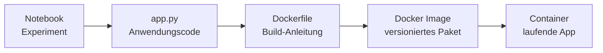

# Docker Deployment
{: .no_toc }

> **ML-Anwendungen reproduzierbar verpacken und ausführen.**  
> Docker bündelt Anwendungscode, Abhängigkeiten, Modellartefakte und Startbefehl in einem Container Image.

---

# Inhaltsverzeichnis
{: .no_toc .text-delta }

1. TOC
{:toc}

---

## Einordnung

Docker ist im ML-Deployment nützlich, wenn eine Anwendung auf unterschiedlichen Rechnern oder Servern gleich laufen soll. Statt Python-Version, Bibliotheken und Modellartefakte manuell auf jedem Zielsystem einzurichten, wird ein Image gebaut und daraus ein Container gestartet.



## Typische Dateien

Ein einfaches Docker-Deployment für eine ML-App besteht meist aus:

| Datei | Aufgabe |
|-------|---------|
| `app.py` | Startbare Anwendung, z. B. Gradio, FastAPI oder Streamlit |
| `requirements.txt` | Python-Abhängigkeiten mit möglichst festen Versionen |
| `Dockerfile` | Anleitung zum Bauen des Images |
| `.dockerignore` | Dateien ausschließen, die nicht ins Image gehören |
| Modellartefakt | z. B. `model.joblib`, `model.pkl`, `model.keras` |
| Deployment-Dokumentation | Build-, Start-, Stop- und Fehlerhinweise |

## Standardablauf

Image bauen:

```bash
docker build -t meine-ml-app .
```

Image prüfen:

```bash
docker images meine-ml-app
```

Container starten:

```bash
docker run --rm --name meine-ml-app-live -p 7860:7860 meine-ml-app
```

Laufende Container prüfen:

```bash
docker ps
```

Container stoppen:

```bash
docker stop meine-ml-app-live
```

## Ports verstehen

Bei Web-Apps muss ein Port aus dem Container auf den Host-Rechner gemappt werden:

```bash
docker run -p 7860:7860 meine-ml-app
```

Die Schreibweise bedeutet:

```text
Host-Port:Container-Port
```

Bei `docker ps` ist diese Unterscheidung wichtig:

```text
0.0.0.0:7860->7860/tcp   Host-Port 7860 ist veröffentlicht
7860/tcp                 nur interner Container-Port, nicht vom Host erreichbar
```

## Typische Fehlerfälle

### Port ist bereits belegt

Fehlermeldung:

```text
Bind for 0.0.0.0:7860 failed: port is already allocated
```

Prüfen:

```bash
docker ps
```

Dann den belegenden Container stoppen oder einen anderen Host-Port verwenden:

```bash
docker stop meine-ml-app-live
docker run --rm --name meine-ml-app-live -p 7861:7860 meine-ml-app
```

### Container-Name ist bereits vergeben

Fehlermeldung:

```text
The container name "... " is already in use
```

Prüfen:

```bash
docker ps -a
```

Gestoppten Container entfernen:

```bash
docker rm meine-ml-app-live
```

### Modellartefakt fehlt

Wenn die App ein gespeichertes Modell lädt, muss das Artefakt im Image vorhanden sein oder zur Laufzeit eingebunden werden. Für Kursbeispiele ist es meist einfacher, das Modellartefakt zusammen mit `app.py` in das Image zu kopieren.

### Versionskonflikte

Gespeicherte ML-Pipelines sind oft empfindlich gegenüber Bibliotheksversionen. Besonders `scikit-learn`-Modelle sollten mit kompatiblen Versionen geladen werden. Deshalb gehören relevante Versionen explizit in `requirements.txt`.

## Kursbetrieb und Produktionsbetrieb

Für Kurs und Demo reicht meist:

```bash
docker run --rm --name meine-ml-app-live -p 7860:7860 meine-ml-app
```

Für produktionsnähere Nutzung kommen weitere Aspekte hinzu:

- versionierte Image-Tags statt nur `latest`
- Registry statt lokalem Build auf dem Zielsystem
- Start im Hintergrund mit `-d`
- Restart-Policy, z. B. `--restart unless-stopped`
- Logs, Healthchecks und Monitoring
- Reverse Proxy und HTTPS bei öffentlichem Zugriff
- Sicherheitshärtung des Images

## Beispiel im Kurs

Das konkrete Diamonds-Gradio-Beispiel liegt hier:

```text
ML_Intro/01_notebook/08_save_load_deploy/docker/
```

Die beispielnahen Anleitungen sind bewusst dort abgelegt:

- `KURS_DEPLOYMENT.md`: lokaler Kurs- und Demoablauf
- `REGISTRY_DEPLOYMENT.md`: Weitergabe über Container Registries
- `PRODUCTION_DEPLOYMENT.md`: produktionsnähere Betriebsaspekte

Dieses Dokument erklärt die allgemeinen Docker-Konzepte. Die konkreten Befehle für das Diamonds-Beispiel stehen in den Dateien im Beispielordner.

## Weiterführende Ressourcen

- [Docker für Python-Entwickler](https://docs.docker.com/language/python/)
- [Dockerfile Referenz](https://docs.docker.com/reference/dockerfile/)
- [Docker run Referenz](https://docs.docker.com/reference/cli/docker/container/run/)
