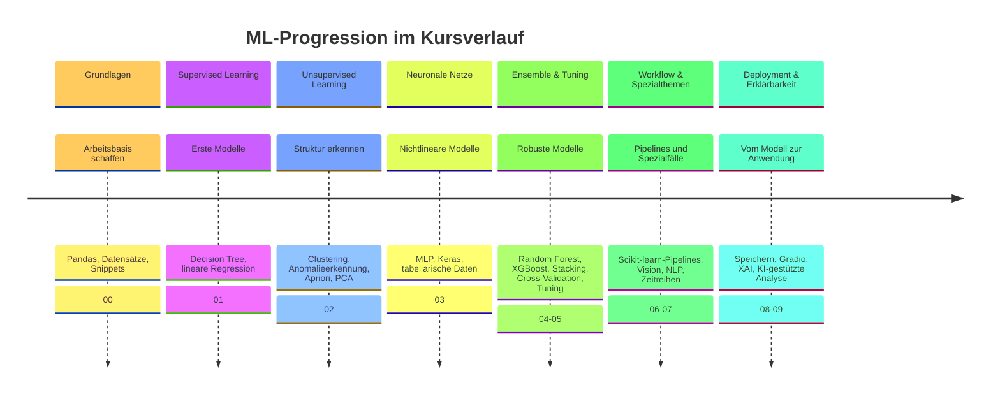

# Kursüberblick
{: .no_toc }

> **Machine Learning. Verstehen. Anwenden. Gestalten.**

---

## Inhaltsverzeichnis
{: .no_toc .text-delta }

1. TOC
{:toc}

---

## Worum es in diesem Kurs geht

Machine Learning steht hier nicht für einen abstrakten Sammelbegriff, sondern für einen konkreten Arbeitsablauf: Daten verstehen, vorbereiten, ein Modell auswählen, die Qualität prüfen und das Ergebnis so bereitstellen, dass es außerhalb des Notebooks nutzbar bleibt.

Der rote Faden sind wiederkehrende Datensätze wie Titanic, Diamonds und Breast Cancer Wisconsin. Sie ziehen sich durch mehrere Module — vom ersten Decision Tree über Ensemble-Methoden und Hyperparameter-Tuning bis zum gespeicherten, deploybaren Modell — und machen sichtbar, wie sich dieselbe Aufgabe mit unterschiedlichen Methoden lösen lässt.

Der Fokus liegt auf praktischer Umsetzung mit Python und scikit-learn. Theorie wird so weit erklärt, wie sie für Verständnis, Modellwahl und Bewertung nötig ist.

## Zielgruppe

Der Kurs passt besonders für:

- Programmierende und Entwickelnde mit Python-Grundlagen, die in Machine Learning einsteigen möchten,
- IT- und Datenfachkräfte, die klassische ML-Verfahren neben Deep Learning einordnen wollen,
- technikaffine Quereinsteigerinnen und Quereinsteiger mit Interesse an Datenanalyse.

Hilfreich sind Grundlagen zu Datentypen, Listen, Dictionaries, Kontrollstrukturen, Funktionen sowie erste Erfahrung mit pandas und numpy.

## Was der Kurs vermittelt

Nach dem Kurs ist es möglich:

- ein ML-Problem als Klassifikation, Regression, Clustering oder Anomalieerkennung einzuordnen,
- Rohdaten für ein Modell aufzubereiten, inklusive Kodierung, Skalierung und Split,
- klassische Verfahren, Ensemble-Methoden und neuronale Netze gezielt auszuwählen,
- Modellqualität über Cross-Validation, Metriken und Visualisierung belastbar zu bewerten,
- Hyperparameter systematisch zu tunen und Overfitting zu erkennen,
- ein Modell zu speichern, per Gradio bereitzustellen und mit XAI-Methoden zu erklären.

Das praktische Ergebnis ist kein einzelnes Modell, sondern ein wiederholbarer Workflow: von Datensatz über Vorbereitung, Modellierung und Evaluation bis zum nutzbaren Ergebnis — übertragbar auf neue Datensätze außerhalb der Notebooks.

## Kursstruktur

Die Module führen von Grundlagen über Supervised Learning, Unsupervised Learning und neuronale Netze bis zu Ensemble-Methoden, Tuning, Spezialanwendungen und Deployment.

| Bereich | Inhalte |
| ------- | ------- |
| **Grundlagen** | Pandas-Basics, Datensatzzugriff, Snippets und Arbeitsumgebung |
| **Supervised Learning** | Klassifikation, Regression, erster Decision Tree und lineare Regression |
| **Unsupervised Learning** | K-Means, DBSCAN, Isolation Forest, Apriori und PCA |
| **Neuronale Netze** | MLP, Keras und tabellarische Daten |
| **Ensemble & Tuning** | Random Forest, XGBoost, Stacking, Cross-Validation, Hyperparameter-Suche, AutoML |
| **Workflow & Spezialthemen** | Scikit-learn-Pipelines, Computer Vision, NLP, Zeitreihen, Autoencoder |
| **Deployment & Erklärbarkeit** | Modell-Export, Gradio-Apps, XAI, KI-gestützte Datenanalyse |

Ergänzend geht es um Bootstrapping, Validation Curves und den Umgang mit KI-Modellen bei der Datenanalyse.

## Kursprogression

## Modulübersicht

Die Module sind in thematische Blöcke gegliedert:

| Modul | Block                           | Inhalt                        | Schwerpunkt                                                        |
| :---: | -------------------------------- | ------------------------------ | ------------------------------------------------------------------ |
|  00   | Grundlagen                       | Einführung & Werkzeuge         | Pandas-Grundlagen, Datensatzzugriff, Snippets                      |
|  01   | Supervised Learning              | Supervised Learning Basics     | Decision Tree (Titanic), lineare Regression (MPG)                  |
|  02   | Unsupervised Learning            | Unsupervised Learning          | K-Means/DBSCAN, Isolation Forest, Apriori, PCA                     |
|  03   | Neuronale Netze                  | Neuronale Netze                | MLP und Keras bei Breast-Cancer- und Diamonds-Daten                |
|  04   | Ensemble & Tuning                | Ensemble-Methoden              | Random Forest, XGBoost, Stacking                                   |
|  05   | Ensemble & Tuning                | Tuning & Validierung           | Cross-Validation, Bootstrapping, Grid-/Random-/RandomizedSearch, ROC-AUC, AutoML |
|  06   | Workflow & Spezialthemen         | Workflow-Pipelines             | Scikit-learn-Pipeline (Diamonds)                                   |
|  07   | Workflow & Spezialthemen         | Spezialanwendungen             | Computer Vision (MNIST, YOLO), NLP (Spam), Zeitreihen, Autoencoder  |
|  08   | Deployment & Erklärbarkeit       | Speichern, Laden & Deployment  | PMML-Export, Pipeline-Persistenz, Gradio-Apps                      |
|  09   | Deployment & Erklärbarkeit       | Erklärbarkeit & KI-Integration | XAI (Titanic), KI-gestützte Datenanalyse                           |

Diamonds, Titanic und Breast Cancer Wisconsin sind die Datensätze, die am häufigsten wiederkehren — sie verbinden Module, die sonst unabhängig voneinander stehen könnten.

| Kursblock | Ausbau des ML-Workflows | Wiederkehrende Beispiele |
| --------- | ----------------------- | ------------------------ |
| **00: Grundlagen** | Daten laden, erste Merkmale verstehen und die Arbeitsumgebung sicher nutzen. | Titanic, Diamonds, Breast Cancer Wisconsin |
| **01: Supervised Learning** | Einfache Klassifikations- und Regressionsmodelle trainieren und erste Vorhersagen bewerten. | Titanic, MPG |
| **02: Unsupervised Learning** | Muster ohne Zielvariable erkennen und explorativ auswerten. | Standortdaten, NID, Food, Special-Datensatz |
| **03: Neuronale Netze** | Erste neuronale Modelle mit klassischen ML-Verfahren vergleichen. | Breast Cancer Wisconsin, Diamonds |
| **04-05: Ensemble & Tuning** | Robustere Modelle trainieren, Varianten vergleichen, Cross-Validation nutzen und Hyperparameter systematisch prüfen. | Titanic, Diamonds, Breast Cancer Wisconsin |
| **06-07: Workflow & Spezialthemen** | Vorbereitung und Modellierung in Pipelines bündeln und Spezialfälle wie Bild-, Text- und Zeitreihendaten einordnen. | Diamonds, MNIST, Spam, Wetterdaten |
| **08-09: Deployment & Erklärbarkeit** | Modelle speichern, als kleine Anwendung bereitstellen und Entscheidungen mit XAI oder Fehleranalyse nachvollziehen. | Diamonds, Titanic |

Einige Begriffe sind bewusst knapp gehalten. **XAI** steht für erklärbare KI und umfasst Methoden, die Modellentscheidungen nachvollziehbarer machen. **SHAP** ist eine XAI-Methode, die Feature-Beiträge zu Vorhersagen schätzt. **AutoML** automatisiert Teile von Vorbereitung, Modellwahl und Tuning. **ROC-AUC** bewertet, wie gut ein Klassifikationsmodell positive und negative Fälle trennt. **PMML** ist ein Austauschformat für gespeicherte Modelle. **YOLO** ist ein verbreitetes Verfahren zur Objekterkennung in Bildern.

## Vorbereitung

Für die praktischen Übungen werden typischerweise benötigt:

- ein Google-Account für Google Colab und Google Drive,
- ein Gerät, auf dem Browser, Notebook-Umgebung und Kursmaterial zuverlässig funktionieren,
- eine lokale oder Colab-Python-Umgebung mit scikit-learn, pandas, numpy, matplotlib und plotly,
- für Modul 09 (Erklärbarkeit & KI-Integration) ein API-Key für ein KI-Modell wie Gemini.

Bei Business-Laptops sollte vorab geprüft werden, ob Cloud-Dienste, API-Zugriffe, GitHub und Google Colab durch die IT-Richtlinien erlaubt sind.

Nützliche Einstiege:

- [Google Colab](https://colab.research.google.com/)
- [scikit-learn](https://scikit-learn.org/stable/)

## Arbeitsweise

Jedes Modul folgt demselben Fünf-Phasen-Workflow: Understand, Prepare, Modeling, Evaluate, Deploy. Diese Struktur bleibt über alle Module gleich, während sich Datensatz, Modelltyp und Fragestellung ändern.

Sinnvoll ist es, einen eigenen Datensatz oder eine eigene Fragestellung mitzubringen. Dadurch wird schneller sichtbar, welche Vorbereitungsschritte, Modelle und Metriken für die eigene Aufgabe tatsächlich passen — und wo ein Standardverfahren an seine Grenzen stößt.

## Lernen mit KI

Generative KI darf als Lern- und Entwicklungshilfe genutzt werden. Bei Fehlermeldungen, Verständnisfragen oder Modellvergleichen kann ein Modell Teilschritte erklären oder alternative Implementierungen vorschlagen.

Die Grenze bleibt wichtig: KI ersetzt nicht das eigene Verständnis von Daten, Modellwahl und Bewertung. Der Schwerpunkt liegt darauf, ML-Workflows selbst zu entwerfen, auszuführen, zu bewerten und zu hinterfragen.

## Kompetenzillusion vermeiden

Hohe Trainingsgenauigkeit, überzeugend klingende SHAP-Erklärungen oder ein AutoML-Ergebnis mit gutem Score können den Eindruck erwecken, ein Modell sei bereits verstanden und einsatzbereit. Tatsächlich zeigt sich die eigentliche Qualität oft erst bei der Bewertung auf Testdaten, bei der Fehleranalyse oder wenn ein Modell auf neue Daten trifft.

<small>KI-generiertes Bild</small>

Deshalb lohnen sich drei wiederkehrende Prüfbewegungen:

- Trainings- und Testergebnisse getrennt betrachten,
- Metriken und Visualisierungen statt einzelner Kennzahlen prüfen,
- Modellentscheidungen mit XAI-Methoden oder Fehleranalyse nachvollziehen.

Konkret heißt das im Kurs: zuerst eine einfache Baseline aufbauen, dann Datenleckagen vermeiden, Train/Test-Split oder Cross-Validation prüfen, passende Metriken wählen und auffällige Fehlvorhersagen genauer untersuchen. XAI kommt erst danach: Eine Erklärung ist nur hilfreich, wenn das Modell selbst belastbar bewertet wurde.

## Zeitfenster für Aufgaben

Für Übungsaufgaben hat sich ein kurzer Arbeitsrhythmus bewährt: etwa **10 Minuten Bearbeitungszeit**, ein kurzer **Zwischenstopp** und anschließend weitere **10 Minuten oder mehr**. Die erste Phase ist lang genug für den Einstieg und kurz genug, damit Blockaden früh sichtbar werden.

Der Check ist keine harte Pflicht-Unterbrechung für alle. Wer gut im Flow ist, kann weiterarbeiten; wer festhängt, bekommt früh Gelegenheit zur Klärung. Bei unterschiedlichem Tempo bleibt der Takt flexibel: Schnellere vertiefen mit zusätzlichen Datensätzen oder Parametervarianten, langsamere sichern zunächst den Kern-Workflow.

Auch während der Übungszeit stehen Fragen jederzeit offen. Wer lieber ungestört im eigenen Flow bleiben möchte, schaltet dafür einfach den eigenen Lautsprecher stumm.

Statt der gestellten Aufgaben lässt sich bei Bedarf auch eine eigene Problemstellung bearbeiten. Unterstützung dafür gibt es, soweit es der Rahmen zulässt.

Fehler gehören zum Lernprozess dazu und sind kein Rückschlag: Eine Fehlermeldung zeigt oft genauer, wie ein System tatsächlich funktioniert, als ein Durchlauf ohne Probleme, und trägt damit direkt zum Lernerfolg bei.

## Nächste Schritte

| Dokument | Frage |
| -------- | ----- |
| [Konzepte](../concepts.html) | Welche Konzepte deckt der Kurs ab? |
| [ML-Workflow](../concepts/grundlagen/ml_workflow_erklaerung.html) | Wie läuft der Workflow von Daten bis Deployment ab? |
| [Modellauswahl](../concepts/modeling/modellauswahl.html) | Welches Modell passt zur Aufgabe? |
| [Deployment](../deployment.html) | Wie kommt ein Modell vom Notebook in den praktischen Einsatz? |

---

**Version:** 1.0 
**Stand:** September 2026 
**Kurs:** Machine Learning. Verstehen. Anwenden. Gestalten.
